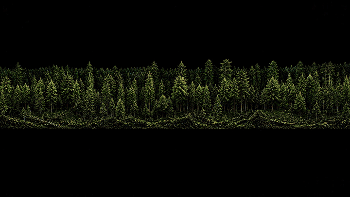

# LiDAR Tree Benchmarks

<!-- HTML preserves the centered header and explicit image width. -->
<!-- rumdl-disable MD033 -->

<p align="center">
  
</p>

<p align="center">
  <strong>Individual-tree detection and crown delineation from airborne
  LiDAR.</strong><br>
  Classical CHM methods · Point-cloud segmentation · Deep models · RGB fusion
</p>

<p align="center">
  <a href="#methods-and-results">Results</a> ·
  <a href="#start-here">Quick start</a> ·
  <a href="#reproduce-a-workflow">Workflows</a> ·
  <a href="#script-reference">Scripts</a>
</p>

<!-- rumdl-enable MD033 -->

This research repository compares tree detectors and crown segmenters across
point densities, forest types, and reference annotations. It contains
standalone R scripts, Python/GPU model adapters, evaluation tools, and reports.
Outputs include treetop coordinates, crown polygons, labelled point clouds,
and detection and delineation metrics.

The main questions are practical: how much does sparse LiDAR change detection,
which methods recover understory trees, and when does combining detectors help?
Start with the results below, or run the bundled tile to explore the methods
without downloading a benchmark dataset.

## Methods and results

### Detection across point densities

The [NEON model comparison](results/model-benchmark-results.md) evaluates
classical CHM methods, point-cloud detectors, and learned instance models on
SJER, SOAP, and TEAK. On SOAP's common set of 18 plots and 232 field stems:

- SegmentAnyTree reaches native-density detection F1 **0.48**, compared with
  **0.38** for CHM variable-window filtering (CHM-VWF). Its F1 falls to **0.13**
  at 1 point/m², showing that native-density performance does not establish
  sparse-density performance.
- The classical `multichm` detector is more stable across the density ladder,
  with F1 **0.42–0.47** from native density through 1 point/m².
- In the [paired RGB-LiDAR study](results/rgb-lidar-fusion-results.md), adding
  RGB detections to the LiDAR union at 1 point/m² raises recall from **0.677**
  to **0.741**, while F1 falls from **0.414** to **0.406**. Optical boxes and
  native-CHM heights are fixed across rungs; this is not a wholly sparse-input
  experiment.

These are field-stem detection scores. Incomplete mapping and event-specific
sampling footprints limit their interpretation as complete-census precision.
The [reference-support audit](results/neon-reference-support-results.md)
documents those limits. Historical three-site and paired SOAP studies use
separate reference populations; compare methods within each study.

The [Pacific Northwest preflight](results/pacific-northwest-extension-results.md)
admits NEON WREF and ABBY, flown in 2021 with the same sensor class, as two
further sites. The new five-site reference keeps stems of at least 10 cm DBH:
106 plots and 2,525 stems, against 46 plots and 699 stems in the historical
SJER, SOAP and TEAK sweep. No detector has been scored at the new sites yet.

The [point-cloud detector study](results/pointcloud-detector-results.md)
compares native-density understory recovery by crown class, with a separate
two-rung density-ladder extension.

### Crown delineation

The [crown benchmark](results/crown-segmentation-results.md) compares growing
rules on a shared canopy-height model (CHM) and common seed basis. On 225
matched field stems, the random walker with a per-crown stopping rule has the
lowest classical diameter RMSE: **2.42 m** for equivalent-circle diameter and
**3.57 m** for maximum-caliper diameter. The corresponding lasR region-growing
errors are **2.62 m** and **3.72 m**.

Diameter definitions matter: equivalent-circle diameter is compared with
`ninetyCrownDiameter`, and maximum-caliper diameter with `maxCrownDiameter`.
These errors measure crown size, separately from detection F1 or point-mask IoU.
The [NEON instance study](results/instance-iou-pq-results.md) uses
Voronoi-on-stems proxy masks, not manually delineated crowns.

### Native FGI-EMIT pipeline

The [native pipeline study](results/final-ensemble-pipeline-results.md) compares
CHM-VWF, SegmentAnyTree (SAT), and ForestFormer3D (FF3D) against manual point
instances. It separates ten development plots from three reserve plots.
FF3D was selected on development data before the reserve was evaluated.

| Detector | Reserve apex F1 | Reserve instance F1 at IoU 0.5 |
| --- | ---: | ---: |
| CHM-VWF | 0.4881 | — |
| SegmentAnyTree | 0.7462 | 0.5758 |
| ForestFormer3D | 0.7761 | 0.6493 |

All three reserve plots and 257 reference trees contribute to these pooled
scores. CHM-VWF has no instance-mask score. FF3D has the highest pooled F1,
although per-plot rankings vary.

The fixed fusion candidates did not beat FF3D on development F1, so the
pipeline's default remains the frozen single-model policy. It exports
separate treetop and instance products; general site/density routing and fused
crown refinement are not validated. Upstream checkpoint training exposure is
unknown, and independent above-ground-height accuracy is unverified. These
results therefore support a conditional within-dataset comparison, not proof
of performance on unseen USGS or NEON data.

### TEAK and USGS-like data

The [USGS 3DEP example](#usgs-3dep-aoi) demonstrates acquisition and processing.
The historical NEON results provide field-stem comparisons in western forests,
including TEAK. Neither alone validates a detector for a new survey.

The [TEAK canopy comparison](results/teak-comparison-workflow-results.md)
provides a review workflow for historical RGB boxes and native LiDAR. Real
accuracy comparison remains blocked by reference review, registration, and
validated crown-box adapters. Its detector compatibility runs establish that
the models execute; they do not establish a TEAK crown-accuracy ranking.

## Benchmark design

The [methodology](docs/treetop-detection-approach.md) explains the processing
and evaluation choices. The main principles are:

- Measure density first. First-return density (`frdens`) controls CHM
  resolution, window size, and smoothing; all-return density (`pdens`)
  controls thinning and prevents requests to upsample sparse inputs.
- Compare equivalent support. Keep site, plot, density, and reference support
  aligned across methods, and report missing or failed cells explicitly.
- Match detections one-to-one within the mapped plot core, with a height gate.
  Pool counts before calculating rates, and error sums before calculating RMSE.
- Keep calibration and evaluation plots separate. Density variants of one
  plot stay together, and frozen reserve results do not select parameters.
- Distinguish field stems, proxy masks, manual point instances, and image
  boxes. They support different claims and cannot share an accuracy ranking.
- Use metric coordinates and explicit height datums. lasR's TIN-based
  `pit_fill` and lidR's `pitfree()` construct different CHMs; the
  [engine comparison](results/treetop-lasr-vs-lidr-comparison.md) includes a
  shared-CHM test to separate surface construction from peak finding.

## Start here

Run commands from the repository root. The core examples need R with **lasR
from `r-lidar/lasR@pre-devel`**, lidR, terra, sf, and data.table. The variable
window used here requires that lasR build; see the
[setup notes](results/density-ladder-sweep-results.md). Model-specific
containers, checkpoints, and environments are documented under [gpu](gpu/).

The following comparison uses `MixedConifer.las` from the lasR installation;
no additional data download is needed:

```sh
export CLAUDE_JOB_DIR="$PWD/work/demo"
mkdir -p "$CLAUDE_JOB_DIR"
Rscript scripts/detect_lasr.R
Rscript scripts/detect_lidr.R
Rscript scripts/compare.R
Rscript scripts/shared_chm.R
```

The two detection scripts write treetop CSVs. `compare.R` compares their
locations, while `shared_chm.R` runs both peak finders on the same CHM. This
tile is an implementation example, not a field-ground-truth accuracy test.

For crown polygons and their comparison, continue with:

```sh
Rscript scripts/segment_lasr.R
Rscript scripts/segment_lidr.R
Rscript scripts/compare_crowns.R \
  "$CLAUDE_JOB_DIR/crowns_lasr.gpkg" \
  "$CLAUDE_JOB_DIR/crowns_lidr.gpkg"
```

## Reproduce a workflow

Use a distinct `CLAUDE_JOB_DIR` for each experiment. Downloaded data, model
resources, and accepted-run artifacts are prerequisites for the larger
studies; a clone does not include them. Most R drivers use `KEY=VALUE`
arguments, while Python drivers use flags. Check the selected script's parser
and linked study instructions before changing its invocation.

### USGS 3DEP AOI

With PDAL 2.9 or later, extract the fixed example area of interest (AOI) from a
public EPT source. The extraction reprojects Web Mercator to UTM before metric
processing. After setting `CLAUDE_JOB_DIR` to a new directory and creating it:

```sh
REPO_ROOT="$(git rev-parse --show-toplevel)"
(cd "$CLAUDE_JOB_DIR" && pdal pipeline "$REPO_ROOT/scripts/extract.json")
Rscript scripts/detect_lasr_aoi.R
Rscript scripts/detect_lidr_aoi.R
Rscript scripts/shared_chm_aoi.R
```

Inspect [extract.json](scripts/extract.json) for the source, bounds, and target
CRS. The [AOI report](results/treetop-lasr-vs-lidr-comparison.md) covers the
comparison and larger-area experiments.

### Field and instance benchmarks

| Workflow | Instructions and results |
| --- | --- |
| NEON field-stem density ladder | [Density-ladder study](results/density-ladder-sweep-results.md) and [cross-model comparison](results/model-benchmark-results.md) |
| Crown diameters and segmentation | [Crown benchmark](results/crown-segmentation-results.md) |
| Paired optical/LiDAR fusion | [RGB-LiDAR comparison](results/rgb-lidar-fusion-results.md) and [confidence calibration](results/confidence-calibration-results.md) |
| Native FGI-EMIT products | [Current execution guide](docs/final-ensemble-pipeline-v2.md) and [development/reserve results](results/final-ensemble-pipeline-results.md) |
| Historical TEAK canopy review | [Review protocol](docs/teak-comparison-workflow-protocol.md) and [current eligibility limits](results/teak-comparison-workflow-results.md) |

NEON acquisition also needs `neonUtilities`, `jsonlite`, `curl`, `digest`,
network access, and `NEON_TOKEN` for downloads. GPU arms require their existing
model environments and weights; use the corresponding runtime guide rather
than a single environment for every detector.

The native FGI-EMIT entry point verifies prepared inputs, a frozen policy, and
accepted inference before assembling products. Follow its guide to supply
those resources and choose a fresh output directory. To explore the assembly
interfaces without models or benchmark data, use the synthetic example:

```sh
Rscript scripts/assemble_metapipeline_v2.R MODE=synthetic \
  OUT="$CLAUDE_JOB_DIR/synthetic-assembly"
```

This needs the core R packages plus `jsonlite` and `digest`, and an output path
that does not exist. It illustrates completed, empty, failed, and unsupported
inputs; it computes no real-data accuracy metrics. See the
[assembly contracts](docs/metapipeline-contracts.md).

## Script reference

These are the main entry points; each study above documents its supporting
scripts and configuration.

| Task | Entry points |
| --- | --- |
| Toy detection and engine comparison | [detect_lasr.R](scripts/detect_lasr.R), [detect_lidr.R](scripts/detect_lidr.R), [compare.R](scripts/compare.R), [shared_chm.R](scripts/shared_chm.R) |
| Toy crown products | [segment_lasr.R](scripts/segment_lasr.R), [segment_lidr.R](scripts/segment_lidr.R), [compare_crowns.R](scripts/compare_crowns.R) |
| USGS extraction and detection | [extract.json](scripts/extract.json), [detect_lasr_aoi.R](scripts/detect_lasr_aoi.R), [detect_lidr_aoi.R](scripts/detect_lidr_aoi.R), [shared_chm_aoi.R](scripts/shared_chm_aoi.R) |
| Tiled point-cloud processing | [tile_aoi.R](scripts/tile_aoi.R), [detect_lasr_catalog.R](scripts/detect_lasr_catalog.R), [detect_lidr_catalog.R](scripts/detect_lidr_catalog.R) |
| NEON acquisition and references | [neon_ground_truth.R](scripts/neon_ground_truth.R), [neon_download_lidar.R](scripts/neon_download_lidar.R), [neon_download_aop.R](scripts/neon_download_aop.R), [preflight_site_extension.R](scripts/preflight_site_extension.R) |
| NEON density ladder | [run_sweep.R](scripts/run_sweep.R), [analyze_sweep.R](scripts/analyze_sweep.R), [compare_sites.R](scripts/compare_sites.R) |
| Point-cloud understory detection | [detect_pc_sweep.R](scripts/detect_pc_sweep.R), [detect_pc_ladder.R](scripts/detect_pc_ladder.R) |
| Cross-model detection analysis | [analyze_model_benchmark.R](scripts/analyze_model_benchmark.R), [compare_model_sites.R](scripts/compare_model_sites.R) |
| Crown-diameter evaluation | [crown_metrics_sweep.R](scripts/crown_metrics_sweep.R), [analyze_crown_metrics.R](scripts/analyze_crown_metrics.R) |
| Detection fusion and calibration | [fuse_detectors.R](scripts/fuse_detectors.R), [calibrate_confidence.R](scripts/calibrate_confidence.R) |
| Native and synthetic product assembly | [assemble_metapipeline_v2.R](scripts/assemble_metapipeline_v2.R), [run_ensemble_pipeline_v2.py](scripts/run_ensemble_pipeline_v2.py) |
| TEAK review preparation and eligibility | [run_teak_comparison_workflow.R](scripts/run_teak_comparison_workflow.R) |

## Repository contents

- [scripts](scripts/) — acquisition, processing, scoring, and export drivers.
- [gpu](gpu/) — model adapters and runtime setup instructions.
- [results](results/) — committed study reports and interpretation limits.
- [docs](docs/) — methodology, study protocols, and execution guides.
- [data](data/) — tracked GeoJSON site, plot, stem, and AOI context.
- [tests](tests/) — regression tests for scoring, data handling, and workflows.

Generated clouds, rasters, tables, review packets, logs, model weights, and
local environments are ignored by Git. Their paths in reports identify local
artifacts, not files available through GitHub. R scripts use
`CLAUDE_JOB_DIR`, defaulting to `work/`; preserve existing results and use fresh
locations for changed experiments.

For R regression tests and documentation checks:

```sh
Rscript tests/run_tests.R
rumdl check --no-cache .
git diff --check
```

Python/GPU tests use the environment required by the affected model or workflow;
raster tests additionally require `rasterio`. Test success checks implementation
contracts; performance claims require the corresponding data and study runs.
