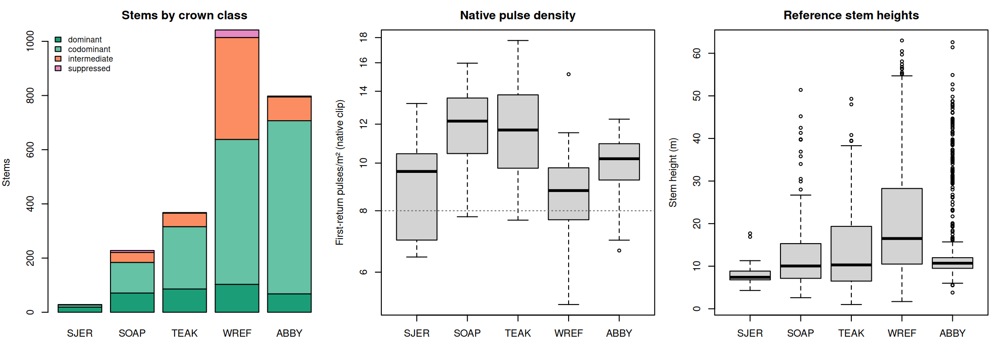
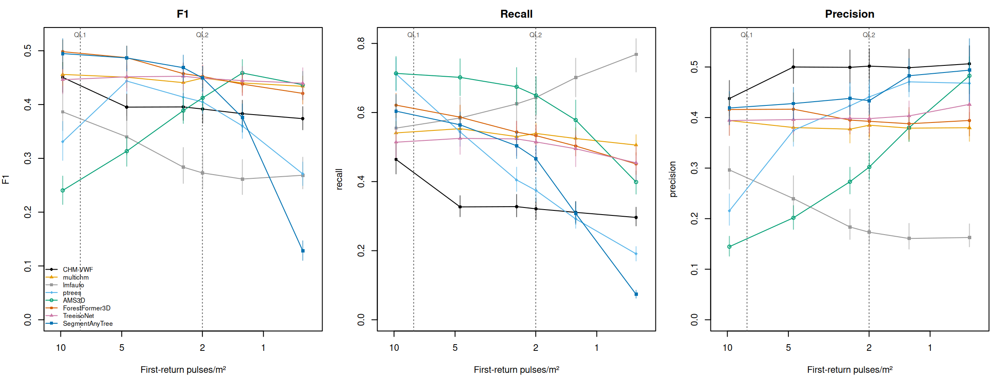
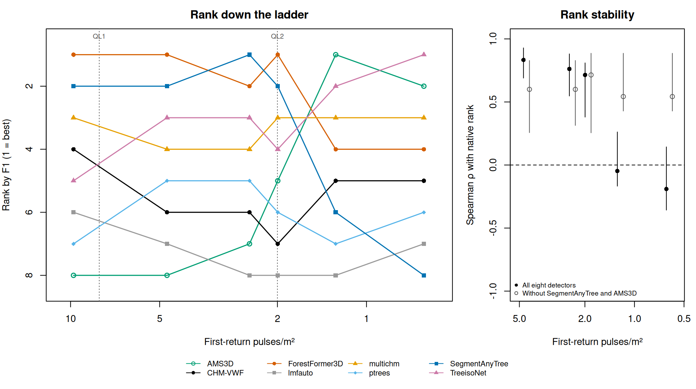
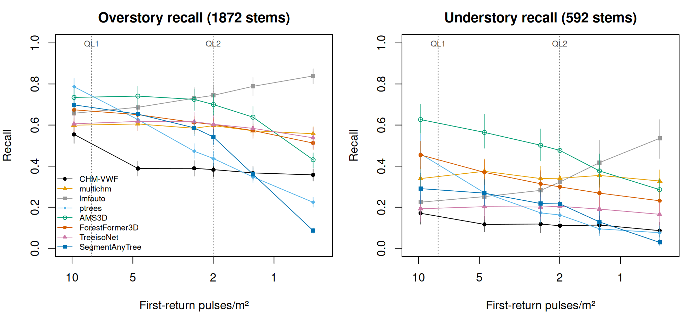
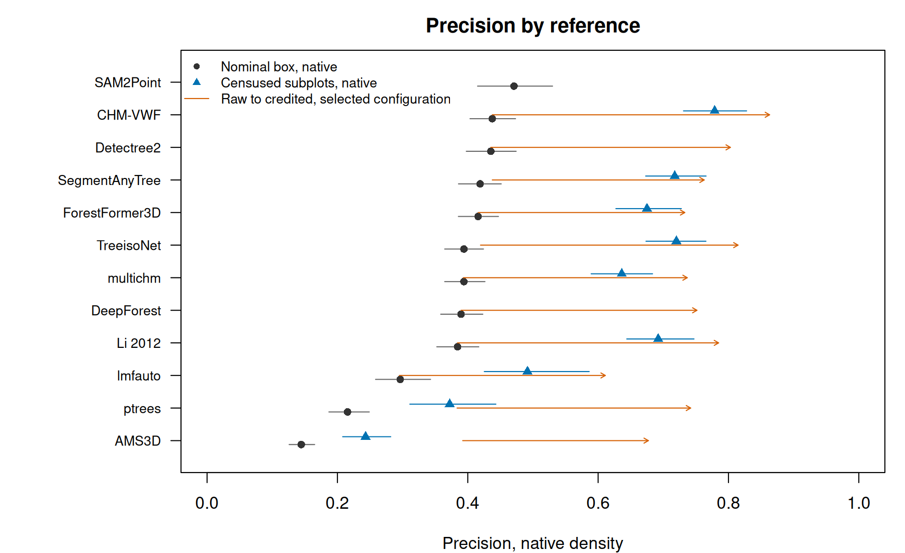
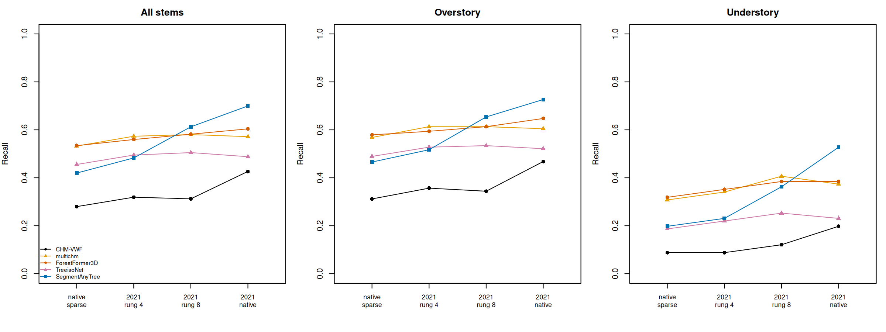
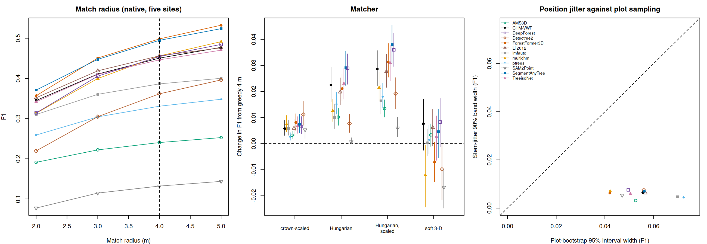

# Native-density performance does not guarantee sparse-density performance

Full title: Native-density performance does not guarantee sparse-density
performance: benchmarking classical and zero-shot deep tree detectors on
national-mapping airborne LiDAR with field-mapped stems.

Alex Grigoryev. Co-authors, affiliations and the corresponding address are to be
completed.

Draft manuscript for the ISPRS Journal of Photogrammetry and Remote Sensing.
Citations use the keys of the repository bibliography (`docs/references.bib`);
every number is taken from a committed study report, listed in the [draft
notes](README.md).

## Highlights

- Eleven detectors scored against 2,525 field stems; eight at six point
  densities.
- At native density, shifted detections reproduce 70–79% of each detector's F1
  at 4 m.
- At native density, the two best segmenters lead CHM-VWF by 0.00–0.03 above
  chance.
- SegmentAnyTree collapses below the QL2 floor; two other segmenters degrade
  slowly.
- Below the QL2 floor two detectors move 0.1–0.4 F1 and break the native
  ranking.

## Abstract

Deep 3D tree instance segmenters are trained and benchmarked on dense laser
scans, while national programmes such as the U.S. Geological Survey's 3D
Elevation Program deliver airborne laser scanning at 2 to 8 pulses/m². We scored
three published zero-shot segmenters, six classical and two aerial-image
detectors against 2,525 field-mapped stems in 106 plots at five National
Ecological Observatory Network sites in California and Washington, on
hash-sealed clips at native density (median 9.8 pulses/m²) and five decimated
densities down to 0.6 pulses/m², one at the quality level 2 (QL2) floor of 2
pulses/m². At native density ForestFormer3D and SegmentAnyTree lead a
canopy-height-model baseline by 0.048 [0.028, 0.069] and 0.044 [0.021, 0.067] F1
at a 4 m match radius, but randomly shifted detections reach 70–79% of every
detector's pooled F1; in chance-corrected F1, at 4 or 2 m, the leads are
0.00–0.02 and 0.02–0.03, clear in California (development) but not Washington
(replication). Density response differs by model: SegmentAnyTree loses 23% of
its recall by the QL2 floor and collapses below it, while ForestFormer3D and
TreeisoNet degrade gracefully. Native-density rank predicts rank to the QL2
floor (Spearman 0.71) but not below it (−0.05), a break carried by
SegmentAnyTree and a mean-shift detector at fixed settings. Precision inside
censused subplots is 0.08–0.34 higher than on nominal plots, and recall on
earlier, natively sparse flights is lower than on decimated clouds. On the dense
FGI-EMIT benchmark the same checkpoints lead the baseline by 0.26–0.29
uncorrected F1. Clips, detections and tables rebuild with one command.

**Keywords:** individual tree detection; airborne laser scanning; point density;
deep learning; instance segmentation; chance agreement; NEON

## 1. Introduction

Individual tree detection from airborne laser scanning (ALS) feeds forest
inventory, carbon accounting, fuel mapping and habitat models. The data that
most practitioners can obtain for a whole ownership or a whole state come from
national mapping programmes. The USGS 3D Elevation Program (3DEP) specifies an
aggregate nominal pulse density of at least 2 pulses/m² for quality level 2
(QL2) and at least 8 pulses/m² for quality level 1 (QL1) [@usgs2026topographic].
These are the densities at which tree detectors are deployed in practice.

Two literatures have grown around the task and they rarely meet. Classical
detectors, such as local maxima on a canopy height model (CHM) with a
height-dependent window [@popescu2004seeing], region growing in the point cloud
[@li2012new], multi-scale point segmentation [@vega2014ptrees] and adaptive mean
shift [@ferraz2016lidar], were developed and compared on conventional airborne
scans of about 1 to 25 pulses/m² [@kaartinen2012international;
@jakubowski2013tradeoffs; @sparks2022crosscomparison]. Deep 3D instance
segmenters [@wielgosz2024segmentanytree; @xiang2025forestformer3d; @xi2025new]
are trained on unmanned, mobile and terrestrial laser scanning and benchmarked
on those and on high-density airborne scans, at hundreds to thousands of points
per square metre [@puliti2023forinstance; @ruoppa2026benchmarking]; the sparsest
conditions they are tested on are subsampled dense scenes.

Whether the published checkpoints of these segmenters help at national-mapping
density is therefore an open question, and three obstacles stand in the way of
answering it. First, no instance labels exist at such densities, so the
reference has to be field-mapped stems, which are incomplete: plots are censused
in subplots, and a detection of a real but unmapped tree counts as an error.
Second, sparse acquisitions are usually simulated by decimating a dense one
[@jakubowski2013tradeoffs], and the simulation is rarely checked against a
native sparse flight of the same stand. Third, research code has to be adapted
to new data, and an adapter defect can be mistaken for domain shift.

This paper addresses the question with a benchmark built to control those
obstacles. We ask (i) how much point density changes detection accuracy, and for
which detectors, (ii) which detectors recover understory trees, and (iii)
whether the ranking of detectors at native density predicts their ranking on
sparser clouds. Our contributions are:

1. An equal-support benchmark of three zero-shot 3D instance segmenters, six
   classical detectors and two RGB detectors at five sites in two regions, on
   sealed, seeded clips at six densities including the QL2 floor, pooled by
   counts with paired plot-level bootstrap intervals and stratified by field
   crown class.
2. Reference-completeness scoring: precision inside censused subplots, with the
   nominal plot as a lower bound and a co-detection credit as a second bracket.
3. The density response of each detector, the stability of the ranking across
   density, the decomposition by site and region, and recall of understory
   trees.
4. A check of decimation against earlier, natively sparse NEON flights over the
   same plots for every learned detector, and against surveys of another sensor.
5. A dense-domain control for two of the three learned detectors, with the same
   checkpoints and adapters, extended by thinning the dense benchmark to the
   sparse densities, and an account of two integration defects that had looked
   like domain shift.
6. An evaluation sensitivity analysis covering chance agreement, the matching
   rule and radius, stem-position uncertainty, the temporal gap between census
   and flight, and the provenance of every configuration.
7. An open harness: frozen clips, pinned checkpoints, hash receipts and an
   archive whose tables rebuild with one command in a clean container.

In short, native-density rank predicts rank down to the QL2 floor; below it two
of the eight ladder detectors move by 0.1 to 0.4 F1 while the other six keep
much of their order. At a 4 m match radius randomly shifted copies of every
detector's detections reach 70 to 79% of its F1 at native density; corrected for
this chance agreement, the native-density leads of the two best dense-trained
segmenters over a simple CHM baseline are 0.00 to 0.03 in corrected F1, and
larger at 4.7 pulses/m² and in California.

## 2. Related work

### 2.1 Benchmarks

Open benchmarks with per-point tree labels are dense. The FOR-instance
collections range from about 500 to 9,500 points/m² [@puliti2023forinstance],
and FGI-EMIT, a multispectral helicopter ALS benchmark, exceeds 1,000 pulses/m²
[@ruoppa2026benchmarking]. FOR-instance v3, introduced with SegmentAnyTreeV2,
states a floor of 10 points/m² obtained by subsampling
[@wielgosz2026segmentanytreev2]. NeonTreeEvaluation is the one benchmark built
on sparse ALS; it annotates crowns in imagery and uses field stems for recall
only [@weinstein2021benchmark]. International comparisons scored classical
detectors against field stems on conventional airborne scans
[@kaartinen2012international; @eysn2015benchmark]. We found no benchmark that
scores deep 3D segmenters against field stems at national-mapping density.

### 2.2 Point density

Studies of point density follow the same split. Classical work varies density
from below 1 to about 25 pulses/m² [@jakubowski2013tradeoffs;
@kaartinen2012international; @sparks2022crosscomparison]. Deep-model studies
vary it between 10 and 10,000 points/m², with the sparsest levels subsampled
from dense acquisitions [@wielgosz2024segmentanytree; @xiang2024automated;
@li2026itsnet]; the FGI-EMIT authors compare models, ForestFormer3D among them,
trained on subsampled versions of one boreal site [@ruoppa2026benchmarking].
@sparks2022crosscomparison compare classical detectors on two ALS datasets of
the same stands, at 8 and 22 pulses/m², but do not test decimation. We found no
paper that evaluates a pretrained 3D segmenter on native ALS at 1 to 2
pulses/m², and none that validates decimation against a native sparse
acquisition of the same stand.

### 2.3 Understory trees

Recall by crown class is reported mainly for classical methods on dense ALS
[@hamraz2017forest; @cao2023benchmarking]. Canopy-surface detectors miss trees
below the canopy by construction; point-cloud methods segment the whole cloud
[@li2012new], and some were designed for layered canopies [@ferraz2016lidar;
@hamraz2017forest]. We found no report of understory recall for a deep model
below 50 points/m².

### 2.4 Evaluation conventions

The dense-cloud community matches predicted and reference instances one to one
at an intersection over union (IoU) of 0.5 [@puliti2023forinstance;
@xiang2025forestformer3d; @ruoppa2026benchmarking]; stem benchmarks match
detections to stems by restricted nearest neighbours [@eysn2015benchmark].
Matching rules are rarely compared, and we found no forestry study that
contrasts greedy with optimal assignment, or that reports how much of a match
score a random placement of the same detections would reach. Reference
incompleteness is acknowledged but seldom measured; NeonTreeEvaluation, for
instance, uses stems for recall only [@weinstein2021benchmark]. Checkpoint
provenance is self-reported: we found no audit of overlap between a checkpoint's
training data and a benchmark's test data.

### 2.5 Recent models

The current state of the art includes SegmentAnyTreeV2
[@wielgosz2026segmentanytreev2], SelectAnyTree [@nguyen2026selectanytree], ForPT
[@yue2026toward] and ITS-Net [@li2026itsnet]. None reports performance at 1 to 8
pulses/m², and we found no public weights for SegmentAnyTreeV2, ForPT or ITS-Net
on 1 October 2026, nor for SelectAnyTree, a promptable model, on 6 October 2026;
the SegmentAnyTreeV2 preprint announces release on acceptance. The statements of
absence in this section rest on a scan of about ninety primary sources completed
on 30 September 2026. We therefore evaluate the first SegmentAnyTree
[@wielgosz2024segmentanytree], ForestFormer3D [@xiang2025forestformer3d] and
TreeisoNet [@xi2025new].

## 3. Data

### 3.1 Sites and airborne LiDAR

The benchmark uses five terrestrial sites of the National Ecological Observatory
Network (NEON) in two regions (Table 1, Fig. 1). The California sites lie on a
gradient of canopy closure in the Sierra Nevada: San Joaquin Experimental Range
(SJER), an open oak and foothill pine woodland; Soaproot Saddle (SOAP), a mixed
conifer forest; and Lower Teakettle (TEAK), a red fir and subalpine conifer
forest. The Washington sites are Wind River Experimental Forest (WREF), an
old-growth Douglas-fir and western hemlock forest, and Abby Road (ABBY), a
managed Douglas-fir forest.

All sites were flown by the NEON Airborne Observation Platform in 2021
[@neon2026discrete]: SJER on 31 March with a RIEGL Q780, and the other four
between 12 and 24 July with an Optech Galaxy Prime. The discrete-return clouds
have a median density of 17.9 points/m² and 9.8 first-return pulses/m² over the
benchmark plots, close to the QL1 specification. All 80 tiles used match the
2026 NEON release by size and checksum.

**Table 1.** Sites and reference population. Plots are tower / distributed.
Crown classes are overstory (dominant and codominant) / understory (intermediate
and suppressed) / not classed. Pulse density is the median and range of
first-return density over the plot clips at native density.

| Site | Forest | 2021 flight | Plots | Stems | Crown classes | Pulses/m² | Censused plots / references |
| --- | --- | --- | --- | ---: | --- | --- | --- |
| SJER | Open oak and foothill pine woodland, California | 31 March, RIEGL Q780 | 6 (6 / 0) | 57 | 27 / 1 / 29 | 9.6 (6.4–13.2) | 2 / 14 |
| SOAP | Mixed conifer, California | 12–13 July, Galaxy Prime | 18 (7 / 11) | 231 | 184 / 44 / 3 | 12.2 (7.8–16.0) | 1 / 2 |
| TEAK | Red fir and subalpine conifer, California | 13–14 July, Galaxy Prime | 19 (6 / 13) | 374 | 316 / 52 / 6 | 11.7 (7.7–17.8) | 9 / 119 |
| WREF | Old-growth Douglas-fir and western hemlock, Washington | 18–24 July, Galaxy Prime | 38 (20 / 18) | 1,063 | 638 / 404 / 21 | 8.8 (5.2–15.2) | 28 / 642 |
| ABBY | Managed Douglas-fir, Washington | 19 and 24 July, Galaxy Prime | 25 (13 / 12) | 800 | 707 / 91 / 2 | 10.2 (6.6–12.3) | 17 / 413 |
| All | | | 106 (52 / 54) | 2,525 | 1,872 / 592 / 61 | 9.8 (5.2–17.8) | 57 / 1,190 |

**Figure 1.** The reference population. Left: classed stems by field crown class
at each site; the 61 stems without a crown class, 29 of them at SJER, are not
shown. Centre: first-return pulse density of the native plot clips; the dotted
line is the QL1 floor of 8 pulses/m². Right: field heights of the reference
stems.

### 3.2 Field reference

The reference is the NEON woody vegetation structure product
[@neon2026vegetation]. Each mapped stem is recorded as a distance and azimuth
from a surveyed point of its plot, which we convert to map coordinates with the
coordinates and uncertainties of the NEON location service. Each stem is paired
with its measurement nearest to 2021 within four years, which supplies its
status, height, diameter at breast height (DBH) and canopy position.

The population was declared before the runs reported here and before any
detector was run on the Washington sites. Its six-tree rule was carried over
from our earlier work on the California sites, and its DBH floor was set from
the Washington field data without detector scores. A reference stem is live,
mapped and at least 10 cm in DBH, and lies inside the nominal plot core: the 40
m × 40 m of a tower plot or the central 20 m × 20 m of a distributed plot. A
plot enters the benchmark if it holds at least six live mapped trees of at least
10 cm DBH, counted over the whole plot; five plots have four or five of them
inside the core. This gives 106 plots and 2,525 stems (Table 1). Two sensitivity
populations are scored alongside: one without the DBH floor (116 plots, 2,854
stems) and one without the six-tree rule (149 plots, 2,628 stems).

Crown class follows NEON's canopy position: full sun is dominant, partially
shaded codominant, mostly shaded intermediate and full shade suppressed. We call
the first two overstory and the last two understory. Sixty-one stems have no
crown class and count only in the totals. Of the 592 understory stems, 404 are
at WREF, so understory results are mostly a statement about that old-growth
site.

NEON does not census whole plots every year. A tower plot is censused in 800 m²
of its 1,600 m² core, so the nominal plot core is not an area in which every
tree is mapped, and many plots have no full census in the flight year. Section
4.3 describes how we handle this.

### 3.3 Frozen clips and the density ladder

Every detector reads the same bytes. For each plot we clip the core plus a 25 m
buffer from the tiles, normalise heights with a triangulated ground surface, and
store the raw clip, the normalised clip, a 1 m terrain model and a manifest.
Sparser acquisitions are simulated by decimating all returns to a target density
on a 5 m grid, with a seed derived from the site, plot and target, before
normalisation, so that the terrain model also sees the sparser cloud. Three
measures make a clip reproducible byte for byte: single-threaded normalisation,
a canonical point order before sampling, and fresh worker processes. The root is
sealed by the SHA-256 of every file, and a detector refuses a clip whose hash
does not match.

The ladder has all-return targets of 8, 4, 2 and 1 points/m². We report measured
first-return density, because pulse density is what acquisition specifications
state: the medians over the 106 plots are 9.8 pulses/m² at native density and
4.7, 2.5, 1.3 and 0.6 pulses/m² on the four rungs. Decimation removes individual
returns, not whole pulses, so the pulse density of a rung is its density of
remaining first returns. The QL2 floor of 2 pulses/m² falls between two rungs.
Before any detector was run on it, we declared one more rung with a target of
3.2 points/m², chosen from measured densities alone so that its median is 2.0
pulses/m², and froze it in a separate root with the same population, native
clips and seeds. Each rung is one seeded realisation shared by all detectors. At
the three California sites, on the earlier population without the DBH floor,
eleven independent seeds of the decimation give a standard deviation of per-site
F1 of 0.005 to 0.028 for the baseline; the spread was not measured for the other
detectors.

### 3.4 Native sparse flights and 3DEP clouds

To test decimation we use earlier NEON flights of the same plots that are
natively sparse: SJER in March 2017 and SOAP and TEAK in June 2018, flown in
NEON's Optech Gemini era, with median first-return densities of 3.9 to 5.0
pulses/m². References were rebuilt for those years, and the comparison uses the
586 stems on 39 plots that are live in both epochs. A second, cross-sensor check
uses public USGS 3DEP clouds over the 43 California plots [@usgs2026usgs],
extracted with PDAL [@butler2021pdal]. None of the covering surveys is at QL2
density (their medians are 47, 31 and 5.7 pulses/m²), so that check compares the
3DEP and NEON clouds decimated to the same target.

### 3.5 Dense-domain control

FGI-EMIT [@ruoppa2026benchmarking; @ruoppa2026fgiemit] provides manual per-point
tree labels for 1,561 trees in 19 plots of boreal forest in Espoo, Finland,
scanned from a helicopter at more than 1,000 pulses/m². The release has six test
plots (463 trees) and 13 training plots. We had already scored the six test
plots in a first transfer experiment and used two training plots in the adapter
audit of Section 5.7, so none of those eight could serve as an untouched test.
Before running any model on the other eleven training plots we set three of them
aside as a reserve (257 trees) by a rule on published stand density; the
remaining eight and the two audit plots form the development set (841 trees). We
selected the detector policy on the development plots and evaluated the reserve
once. Points of the trees that the release marks as partial and leaves
unlabelled (about 4% of the points) are removed before inference, so every tree
left in a cloud is a reference tree. We compared the published training lists of
both checkpoints with FGI-EMIT and found no documented overlap, but no source
gives a complete training history of the released weights, so independence is
not proven and the reserve is a within-dataset check, not an independent test.

## 4. Methods

### 4.1 Detectors

Table 2 lists the detectors. All settings were fixed before the Washington sites
were scored (Section 4.6). The California sites served for development: the
two-tier form of the baseline's canopy-model rule and the matching rule come
from our earlier work on those sites, ForestFormer3D's scene layout and
TreeisoNet's voxel were changed after their first California runs, and
TreeisoNet's confidence threshold of 0.22 was chosen on the pooled F1 of five
SOAP plots.

**Table 2.** Detectors. The three learned point detectors are used zero-shot
with their published checkpoints. DeepForest's training annotations include two
of the benchmark sites, SJER and TEAK, so it is not zero-shot there.

| Detector | Type | Input | Training data | Implementation |
| --- | --- | --- | --- | --- |
| CHM-VWF | Local maxima on a canopy height model, height-dependent window [@popescu2004seeing] | Normalised cloud, first returns | None | lasR [@roussel2026lasr] |
| `multichm` | Local maxima over a stack of height-sliced canopy models, after @eysn2015benchmark | Normalised cloud | None | lidRplugins [@roussel2023lidrplugins] |
| `lmfauto` | Point local maxima, automatic window | Normalised cloud | None | lidRplugins |
| `ptrees` | Multi-scale point segmentation [@vega2014ptrees] | Normalised cloud | None | lidRplugins |
| AMS3D | Adaptive mean shift in 3D [@ferraz2016lidar] | Normalised cloud | None | crownsegmentr [@steinmeier2025crownsegmentr] |
| Li 2012 | Point-cloud region growing [@li2012new] | Normalised cloud | None | lidR [@roussel2020lidr] |
| ForestFormer3D | Transformer instance segmentation [@xiang2025forestformer3d] | Raw cloud, whole scene | FOR-instanceV2: unmanned, mobile and terrestrial laser scanning [@xiang2025forinstancev2] | Published code and weights |
| SegmentAnyTree | Sparse convolutional instance segmentation [@wielgosz2024segmentanytree] | Raw cloud | FOR-instance and mobile scans, with copies sparsified to 10–1,000 points/m² | Published code and weights |
| TreeisoNet | Tree localisation and offset networks [@xi2025new]; the airborne checkpoints distributed with TreeAIBox | Normalised cloud, 0.8 × 0.8 × 2.0 m voxels for tree tops | Unmanned laser scanning at about 1,160 points/m², as described for the TreeAIBox models; the match to the files we ran is inferred from their names | TreeAIBox [@nrcan2025treeaibox] |
| DeepForest | Crown boxes in RGB imagery [@weinstein2020deepforest] | 10 cm camera mosaic [@neon2026camera] | Crowns from 22 NEON sites, then hand annotations from six, including SJER and TEAK | `deepforest-tree` [@weecology2024deepforesttree] |
| Detectree2 | Crown polygons in RGB imagery [@ball2023accurate] | 10 cm camera mosaic | Tropical forests and an urban site | Published weights [@ball2025detectree2] |

**The baseline.** CHM-VWF, local maxima on a canopy height model found with a
variable window filter, derives its parameters from measured density. The canopy
model is a triangulation of first returns rasterised at 0.25 m when the clip has
at least 8 first returns per square metre and at 0.5 m otherwise. Pits are
filled with lasR's pit filling, which is a fill applied to the rasterised
surface and not the pit-free algorithm of @khosravipour2014generating, and below
8 pulses/m² the surface is smoothed with a circular moving mean 3 m across
(lasR's `focal`, whose window is set in map units). Tree tops are local maxima
in a circular window of diameter 0.1 h + 3 m, clamped to 3 to 5 m, above 2 m.
Eighteen of the 106 plots fall below 8 pulses/m² at native density and take the
0.5 m branch there.

**Other classical detectors** run with package defaults or the parameters of
their source publications, which are not adapted to density; AMS3D, for example,
uses the crown-shape ratios of @ferraz2016lidar at every density. Li 2012 is run
at native density only, because the segmenter is not meaningful on the sparsest
clouds.

**Learned point detectors** receive the same clips, with no fine-tuning. For
SegmentAnyTree and ForestFormer3D each predicted instance is reduced to its
highest point, expressed as height above the frozen terrain model.
ForestFormer3D runs on the whole scene, a layout adopted after an audit on
FGI-EMIT exposed an adapter defect (Section 5.7). TreeisoNet's detections are
the peaks of its localisation network above a confidence of 0.22, moved to the
highest canopy point within 2 m; its offset network is used only for masks. Its
localisation pass uses voxels of 0.8 × 0.8 × 2.0 m at every site, the airborne
setting of TreeAIBox, and not the checkpoint's own voxel; our first runs had
used the checkpoint voxel at two sites, which a re-run on the frozen clips
exposed (Section 5.7).

**RGB detectors** predict crowns in the 2021 NEON camera mosaic. A crown becomes
a detection at its centroid, with the height of the native canopy model there.
They have no density ladder and appear at native density only. A twelfth arm,
SAM2Point [@guo2024sam2point], a promptable segmenter built on SAM 2
[@ravi2024sam] and prompted with CHM-VWF tops, lost most of its seeds in dense
plots; it is reported in Section S10 and in the sensitivity analysis of Section
5.8 for completeness and is not analysed.

### 4.2 Scoring

Reference stems in the plot core are matched one to one to detections in the
core or within 4 m of it, greedily by increasing horizontal distance, within 4
m, so that a stem at the edge of the core can take an apex just outside it. A
height gate keeps a short stem from taking a tall neighbour's apex: the
detection's height must lie between half the stem's height and the stem's height
plus 8 m. Stems without a height are matched on position alone. The 4 m radius,
chosen in our earlier work on the California sites, covers the stem-mapping
uncertainty and the displacement between stem base and crown apex.

Recall is the share of reference stems matched. Precision is the share of
detections inside the core that are matched; detections in the 4 m margin count
for recall only (8 to 9% of the learned detectors' matches). F1 is their
harmonic mean. Rates are pooled by summing counts over plots, never by averaging
plot rates, so that a small plot does not dominate. Within each density an
equal-support guard keeps only the plot cells that every included detector
scored; with complete arms it drops nothing.

**Chance agreement.** The plot cores hold 1.2 reference stems per 50 m², the
area of a 4 m circle, and the detectors place 0.8 to 5.7 core detections in the
same area at native density, so a share of every match is co-location. We
measure it with a null that keeps each detector's detections and breaks their
relation to the stems, a random toroidal shift [@lotwick1982methods]. In each
plot the detections within the core and its matching margin are shifted together
by a random offset, wrapped at the edges of that square, at least 8 m from no
shift; their number, heights and spacing are kept. The same 200 offsets are used
for every detector and density. A detector's null score is computed from its
mean counts over the 200 shifts and pooled like an observed score. The null is
the score of copies with no skill at placing trees, not an estimate of the
chance part of the observed score. Subtracting it is conservative, because a
detection that makes a real match cannot also match by chance, so the null tends
to overstate the chance part, more so for detectors whose null is high; the
shift also moves detections off the canopy patches in which they were found,
which could work the other way, and the 2 m results bear out the first effect
(Section 5.8). If a share s of stems is found by skill and the rest can match
only by chance, recall = s + (1 − s) × null, so s = (recall − null) / (1 −
null). We therefore report corrected F1, (F1 − null F1) / (1 − null F1), the
excess over the null scaled by the headroom to a perfect score, as Cohen's kappa
corrects agreement for chance [@cohen1960coefficient]; against an incomplete
reference a perfect score is not attainable, so corrected F1 compares detectors
rather than measuring an attainable share. The plain differences are given
beside it. A corrected lead over CHM-VWF is a difference of corrected scores,
with paired intervals. Because the shift keeps each detector's number, heights
and spacing of detections, corrected scores measure registration to the mapped
stems rather than every aspect of detection. The null is computed at the 4 m
radius and again at 2 m, on every rung including the one at the QL2 floor.

### 4.3 Reference completeness

A detection in a part of a plot that was not censused, or of a tree that was
censused but not mapped, counts against precision although it may be correct. We
bracket this bias in two ways.

**Censused subplots.** For each plot we take the nearest census of all growth
forms within four years of the flight, joined by census event, and reconstruct
its sampled footprint from the surveyed corners of the subplots, eroded by the
positional uncertainty plus 0.6 m. A subplot that holds a census target without
a usable mapped position is removed, because a correct detection there would be
scored as an error. Precision is computed from detections inside the remaining
interior, and recall from its references with the 4 m tolerance around it. The
censused reference is the census event's own records of live trees of at least
10 cm DBH, not the paired stems of Section 3.2, which is why the 57 admitted
plots hold 1,190 censused references against 1,607 population stems. Smaller,
dead and unmapped trees inside a censused subplot still count against precision,
so censused precision is relative to that reference and remains a lower bound.
Fifty-seven plots are admitted (33 tower, 24 distributed; Table 1, Section S4);
of the others, 20 have no usable census of all growth forms in the window, 18
are lost to unmapped targets and 11 fail consistency or geometric checks. A
stricter rule that also removes subplots with a target lacking a height is
reported as a sensitivity, as is the exact 2021 census on 16 tower plots.

**Co-detection credit.** A core false positive with no mapped stem within 4 m,
matched or not, is credited as a probable tree when detectors from at least two
other families (canopy-model, point-cloud, learned, RGB) each leave such a false
positive within 2 m of it. A credited detection leaves the precision
denominator, and nearby credited detections count once. Each detector is scored
at the density it scores best at per site, so credited scores are not those of
Table 3 (Table S5). Credited F1 is a second bracket, reported separately.

The headline tables use the nominal plot core on all 106 plots, with precision
read as a lower bound; the censused scores are reported beside them as the
reference-completeness bracket.

### 4.4 Uncertainty

Every pooled number and every difference between two detectors carries a 95%
percentile interval from a paired bootstrap: plots are resampled with
replacement within each site, 1,000 times, and one set of draws is shared by all
detectors, densities and metrics, so that differences are paired. The intervals
express plot sampling only, condition on the five sites, and are not adjusted
for the number of contrasts; we treat a contrast whose interval ends within
about 0.01 of zero as weak. Decimation noise (Section 3.3), stem-position
uncertainty (Section 4.8) and run-to-run jitter of the canopy model are separate
sources and are not included.

### 4.5 Rank stability

For the eight detectors with a full ladder we compute the Spearman correlation
between their F1 at native density and their F1 at each rung. Each bootstrap
draw ranks the detectors again, which gives the correlation an interval. The
bootstrap resamples plots and not detectors, so we also recompute each
correlation with each detector left out in turn and, as a check chosen after
seeing the results, with the two detectors whose rank changes most below the QL2
floor left out together.

### 4.6 Development and replication regions

The Washington sites were added after the detectors had been run on the
California sites, and they hold 74% of the reference stems. A provenance record
lists every tunable setting, the data it was chosen on and the commit that fixed
it (Section S11). Every detector setting behind the headline tables was fixed
before the Washington sites were scored, from California data, FGI-EMIT, the
literature or package defaults; four later changes are defect fixes or affect
throughput only. We therefore report California as the development region, in
which some settings are in sample, and Washington as the replication region. Two
limits apply. The subplot-exclusion rule of the censused scoring was narrowed
after censused scores that included Washington existed, which is why the
stricter rule is reported beside it. Credited F1 and the fusion experiments of
the supplement select configurations per site in sample and are not part of the
replication.

### 4.7 Decimation checks

On the native sparse flights we run CHM-VWF, `multichm` and the three learned
detectors on clips frozen from the 2017 and 2018 tiles, and score both the
sparse flight and the decimated 2021 rungs that bracket its density against the
same 586 stems. On these 39 plots the two rungs have median densities of about
5.4 and 2.9 pulses/m². Differences carry paired plot-bootstrap intervals (2,000
draws). The comparison mixes the difference between decimation and a native
acquisition with other differences: another instrument generation with a
different number of returns per pulse, another month at two sites, and three to
four years of canopy change. It shows the direction and rough size of the bias,
not a correction. On the 3DEP clouds, CHM-VWF (with the 0.5 m canopy model) and
`multichm` are run on the 3DEP cloud and on the NEON cloud, both decimated to 2
points/m² (about 1.5 pulses/m² on these plots), with paired intervals from 1,000
draws.

### 4.8 Sensitivity analyses

All sensitivity analyses re-score persisted detections; no detector is run
again. (i) Matching: Hungarian assignment, a tolerance scaled by field crown
width, a soft three-dimensional cost, and radii of 2 to 5 m, each with paired
leads over CHM-VWF. (ii) Stem position: 200 draws in which each stem is moved
independently by its recorded positional uncertainty (median 0.4 to 0.5 m).
(iii) Temporal gap: scoring only against stems measured in 2021, on the 44 plots
that have any (1,318 of their 1,557 stems), with paired leads by region. (iv)
Tuning: a calibration and validation split of the baseline's parameter grid over
ten seeds. (v) Chance agreement: the null of Section 4.2, at radii of 4 and 2 m.

### 4.9 Dense-domain control and thinning

On the FGI-EMIT reserve we run CHM-VWF, SegmentAnyTree and ForestFormer3D with
the checkpoints and whole-scene inference of the NEON runs, under the policy
frozen on the development plots, which keeps predicted instances of at least 40
points and 1.5 m vertical extent. Apexes are scored with a greedy one-to-one
matcher (4 m horizontally, 5 m in height) and masks at IoU 0.5 against the
manual labels. TreeisoNet has no dense-domain control: on two FGI-EMIT plots its
masks stayed weak after its export was corrected, and it was left out of the
development and reserve evaluations.

To separate density from the other differences between the datasets, we thin the
ten development plots to the NEON densities under a protocol declared before any
thinned cloud existed. The thinning is the seeded 5 m decimation of Section 3.3
with two differences: each plot's all-return target is the pulse target divided
by its share of first returns, and heights above ground are kept from the dense
cloud, so a thinned cloud has a better terrain model than a sparse acquisition
would. It is also a random subsample of a low-altitude helicopter survey, not an
airborne acquisition at that density. The measured densities are 11.3, 5.4, 2.9,
1.5 and 0.7 pulses/m², about 15% above the targets. Instances are reduced to
their apex and kept if the apex is at least 2 m above ground; the 40-point
filter of the frozen policy removes most instances below 3 pulses/m² and is
reported as a sensitivity (at native density the two rules differ by at most
0.003 apex F1). Apexes are scored against all 841 reference apexes, with a
paired whole-plot bootstrap.

### 4.10 Implementation and reproducibility

The classical detectors run in R with lidR [@roussel2020lidr], lasR and
lidRplugins; the learned detectors run in containers built from the published
code, with checkpoint hashes and image identifiers recorded per run. Every NEON
table in this paper is rebuilt from persisted detections by one script. A
clean-container run against an earlier staging of the archive rebuilt 1,221
files, none differing from the archived copies beyond declared tolerances for
canopy-model noise; the chance-agreement null and the leave-out rank
correlations were added to the script after that run. The FGI-EMIT tables are
rebuilt from the dataset, which its licence does not let us redistribute, and
the timings reported in Section 5.9 depend on the machine.

## 5. Results

### 5.1 Accuracy at native density

At a median of 9.8 pulses/m², ForestFormer3D and SegmentAnyTree have the highest
F1, 0.498 and 0.495, against 0.450 for CHM-VWF (Table 3). Their leads over the
baseline, +0.048 and +0.044, have intervals that exclude zero, and the two are
indistinguishable from each other. `multichm`, Li 2012, TreeisoNet and
DeepForest are indistinguishable from CHM-VWF. The detectors differ far more in
how they reach their F1 than in F1 itself: recall ranges from 0.46 to 0.71 and
precision from 0.15 to 0.44 among the LiDAR detectors, with the point-clustering
detectors AMS3D and `ptrees` at the high-recall, low-precision end. The two
observed leads also hold in the population without the DBH floor, and
ForestFormer3D's in the population without the six-tree rule (Table S3). The
censused columns of Table 3 are discussed in Section 5.5.

Randomly shifted copies of each detector's detections, which keep their number,
heights and spacing, reach 70 to 79% of its F1 at 4 m, pooled over the five
sites (52 to 66% in California and 75 to 84% in Washington): the null F1 is
0.318 for CHM-VWF, 0.361 for ForestFormer3D and 0.345 for SegmentAnyTree. This
is the score of copies with no skill at placing trees, and it tends to overstate
the chance part of the observed score (Section 4.2). The segmenters' null scores
are higher than the baseline's partly because they place more detections, 1.65
and 1.61 per 50 m² of core against 1.19 for CHM-VWF and 1.21 reference stems;
the number is not the whole explanation, since Li 2012, with as many detections
(1.66), has a null F1 of 0.325. Under the null the segmenters already lead the
baseline by 0.043 and 0.027. Corrected for chance, ForestFormer3D's lead is
+0.020 [−0.002, +0.041] and SegmentAnyTree's +0.034 [+0.008, +0.057], a weak
contrast by the rule of Section 4.4; the plain differences above the null are
smaller, +0.005 and +0.017. No other detector leads the baseline after
correction: Li 2012 is level with it, and `multichm`, TreeisoNet and DeepForest
are 0.007 to 0.017 behind with intervals that span zero. Corrected F1 lies
between 0.06 and 0.23 for all eleven detectors.

**Table 3.** Accuracy at native density (median 9.8 pulses/m²), five sites, with
95% intervals. Nominal plot core: 106 plots and 2,525 stems. Null F1: F1 of the
randomly shifted detections. Corrected F1: (F1 − null F1) / (1 − null F1), at
the 4 m radius (Section 4.2). Censused subplots: 57 plots and 1,190 references.
The RGB detectors are not in the censused scorer.

| Detector | Recall | Precision | F1 | F1 lead over CHM-VWF | Null F1 | Corrected F1 | Corrected lead | Censused precision | Censused F1 |
| --- | --- | --- | --- | --- | --- | --- | --- | --- | --- |
| ForestFormer3D | 0.621 | 0.416 | 0.498 [0.478, 0.520] | +0.048 [+0.028, +0.069] | 0.361 | 0.215 [0.191, 0.239] | +0.020 [−0.002, +0.041] | 0.675 | 0.668 [0.640, 0.695] |
| SegmentAnyTree | 0.604 | 0.419 | 0.495 [0.466, 0.522] | +0.044 [+0.021, +0.067] | 0.345 | 0.229 [0.201, 0.255] | +0.034 [+0.008, +0.057] | 0.718 | 0.677 [0.644, 0.708] |
| `multichm` | 0.541 | 0.394 | 0.456 [0.435, 0.477] | +0.005 [−0.018, +0.028] | 0.338 | 0.178 [0.158, 0.202] | −0.017 [−0.039, +0.005] | 0.636 | 0.597 [0.570, 0.626] |
| Li 2012 | 0.561 | 0.384 | 0.456 [0.426, 0.483] | +0.006 [−0.009, +0.019] | 0.325 | 0.195 [0.172, 0.217] | +0.000 [−0.015, +0.014] | 0.692 | 0.638 [0.599, 0.676] |
| DeepForest (RGB) | 0.545 | 0.390 | 0.454 [0.428, 0.478] | +0.004 [−0.014, +0.022] | 0.328 | 0.188 [0.163, 0.212] | −0.007 [−0.028, +0.012] | — | — |
| CHM-VWF | 0.464 | 0.438 | 0.450 [0.423, 0.478] | — | 0.318 | 0.195 [0.169, 0.222] | — | 0.779 | 0.608 [0.566, 0.651] |
| TreeisoNet | 0.514 | 0.394 | 0.446 [0.420, 0.470] | −0.004 [−0.018, +0.009] | 0.322 | 0.183 [0.161, 0.205] | −0.011 [−0.029, +0.005] | 0.720 | 0.622 [0.581, 0.663] |
| `lmfauto` | 0.555 | 0.296 | 0.386 [0.352, 0.421] | −0.064 [−0.095, −0.030] | 0.288 | 0.138 [0.115, 0.165] | −0.056 [−0.079, −0.034] | 0.492 | 0.539 [0.494, 0.594] |
| Detectree2 (RGB) | 0.309 | 0.435 | 0.362 [0.334, 0.390] | −0.089 [−0.120, −0.060] | 0.257 | 0.141 [0.118, 0.165] | −0.054 [−0.088, −0.021] | — | — |
| `ptrees` | 0.712 | 0.215 | 0.331 [0.296, 0.369] | −0.120 [−0.154, −0.085] | 0.257 | 0.099 [0.080, 0.124] | −0.095 [−0.123, −0.067] | 0.372 | 0.496 [0.439, 0.554] |
| AMS3D | 0.713 | 0.145 | 0.240 [0.214, 0.267] | −0.210 [−0.240, −0.180] | 0.190 | 0.063 [0.051, 0.075] | −0.132 [−0.159, −0.107] | 0.243 | 0.364 [0.322, 0.404] |

### 5.2 Density response and rank stability

Down the ladder the detectors part (Table 4, Fig. 2). SegmentAnyTree stays in
the leading group to the QL2 rung but loses ground on the way: at 2.0 pulses/m²
its F1 is 0.449, 0.045 [0.023, 0.069] below its native score with almost a
quarter of its recall lost, and level with ForestFormer3D, TreeisoNet and
`multichm` (0.449 to 0.452). Its lead over CHM-VWF there, +0.058 [+0.036,
+0.081], is as large as at native density only because the baseline lost more at
its own rule switch, and its lead over `multichm` has fallen from +0.039
[+0.016, +0.060] to zero (+0.000 [−0.023, +0.022]). Below the floor it
collapses, to 0.376 at 1.3 pulses/m², where it is level with CHM-VWF (−0.007
[−0.030, +0.016]) and behind `multichm` (−0.064 [−0.093, −0.039]), and to 0.128
at 0.6 pulses/m². The loss is one of recall, which falls from 0.604 at native
density to 0.467 at the floor, 0.308 at 1.3 and 0.074 at 0.6 pulses/m², while
precision rises slightly. The collapse is not a loss of chance agreement:
SegmentAnyTree's corrected F1 falls from 0.229 at native density to 0.150 at 1.3
and 0.047 at 0.6 pulses/m² (Table S12).

**Table 4.** F1 by density for the eight detectors with a full ladder, five
sites, nominal plot core. Columns give the median first-return density in
pulses/m²; the 2.0 column is the rung declared at the QL2 floor. The leads at
0.6 pulses/m² are in F1 and in corrected F1 (Section 4.2).

| Detector | 9.8 | 4.7 | 2.5 | 2.0 | 1.3 | 0.6 | Lead over CHM-VWF at 0.6 | Corrected lead at 0.6 |
| --- | --- | --- | --- | --- | --- | --- | --- | --- |
| ForestFormer3D | 0.498 | 0.487 | 0.457 | 0.452 | 0.438 | 0.421 | +0.047 [+0.022, +0.069] | +0.000 [−0.024, +0.022] |
| SegmentAnyTree | 0.495 | 0.487 | 0.469 | 0.449 | 0.376 | 0.128 | −0.246 [−0.268, −0.223] | −0.117 [−0.139, −0.097] |
| TreeisoNet | 0.446 | 0.452 | 0.453 | 0.449 | 0.444 | 0.440 | +0.066 [+0.037, +0.093] | +0.021 [−0.005, +0.046] |
| `multichm` | 0.456 | 0.451 | 0.441 | 0.449 | 0.440 | 0.434 | +0.060 [+0.036, +0.082] | −0.008 [−0.031, +0.011] |
| CHM-VWF | 0.450 | 0.395 | 0.396 | 0.392 | 0.383 | 0.374 | — | — |
| AMS3D | 0.240 | 0.313 | 0.389 | 0.412 | 0.459 | 0.437 | +0.063 [+0.033, +0.093] | +0.020 [−0.006, +0.045] |
| `ptrees` | 0.331 | 0.444 | 0.414 | 0.405 | 0.360 | 0.271 | −0.103 [−0.122, −0.083] | −0.061 [−0.083, −0.040] |
| `lmfauto` | 0.386 | 0.340 | 0.284 | 0.273 | 0.262 | 0.269 | −0.105 [−0.148, −0.063] | −0.091 [−0.116, −0.068] |

The other two learned detectors do not share that cliff. ForestFormer3D declines
slowly, by 0.08 F1 over the whole ladder, and TreeisoNet is flat (0.440 to
0.453). The classical detectors differ as much among themselves. `multichm`
loses at most 0.022. CHM-VWF loses 0.055 at the first rung, where most plots
cross to the coarser, smoothed canopy model and its recall falls from 0.464 to
0.327, and little after that. AMS3D gains as the cloud thins, from 0.240 to
0.459 at 1.3 pulses/m², because it splits fewer crowns; `ptrees` loses three
quarters of its recall (0.712 to 0.191); `lmfauto` gains recall and loses more
precision. The response differs among the three checkpoints and among the
classical detectors, so method family does not determine it.

Chance agreement changes how the observed leads below native density read. At
0.6 pulses/m² ForestFormer3D, TreeisoNet, `multichm` and AMS3D lead CHM-VWF by
0.05 to 0.07, but the baseline's coarse canopy model places 0.64 to 0.72
detections per 50 m² on the rungs, against 1.19 at native density, and so earns
fewer chance matches. Corrected for chance, those four leads are −0.008 to
+0.021 and none excludes zero (Table 4), and the baseline's corrected F1 falls
only from 0.195 at native density to 0.161 to 0.172 on the rungs. At the QL2
rung the observed leads of ForestFormer3D, SegmentAnyTree, TreeisoNet and
`multichm`, 0.057 to 0.060, become +0.001 to +0.017 in corrected F1 at 4 m, none
excluding zero. Corrected leads that exclude zero at 4 m appear only at the
denser rungs: SegmentAnyTree's at 4.7 and 2.5 pulses/m² (+0.053 and +0.033, the
second weak) and ForestFormer3D's at 4.7 pulses/m² (+0.041). At a 2 m radius
TreeisoNet's corrected lead of +0.024 to +0.035 excludes zero on every rung
below native density, all but one weakly, as do AMS3D's at 0.6 pulses/m² (+0.023
[+0.003, +0.044], weak) and SegmentAnyTree's at 4.7 pulses/m² (+0.036 [+0.014,
+0.059]); at 4 m none of TreeisoNet's intervals excludes zero (Table S12).

**Figure 2.** F1, recall and precision against median first-return pulse
density, five sites, nominal plot core, with 95% plot-bootstrap intervals.
Dotted lines mark the QL1 (8 pulses/m²) and QL2 (2 pulses/m²) floors.

The ranking at native density carries over to the QL2 floor, and below it two
detectors break it (Fig. 3). The Spearman correlation with the native ranking is
0.83 [0.69, 0.93] at 4.7 pulses/m², 0.76 [0.55, 0.88] at 2.5 and 0.71 [0.38,
0.81] at 2.0, then −0.05 [−0.17, 0.26] at 1.3 and −0.19 [−0.36, 0.14] at 0.6
pulses/m². Inside censused subplots the same break appears (0.52 [0.14, 0.71] at
2.0 and 0.02 [−0.19, 0.21] at 1.3 pulses/m²). The intervals express plot
sampling and not the choice of detectors: leaving one detector out moves the
correlation at 1.3 pulses/m² between −0.29 and +0.43 (Table S13). The break is
carried by two detectors, singled out after seeing the results. One is
SegmentAnyTree. The other is AMS3D, which runs with fixed literature settings
that were not tuned to density, while the baseline derives its parameters from
density; it rises from last at native density to a nominal first at 1.3
pulses/m², within 0.021 F1 of ForestFormer3D, TreeisoNet and `multichm`, and
none of the three differences excludes zero. Without AMS3D the correlation is
0.43 [0.21, 0.75] at 1.3 and 0.11 [−0.11, 0.36] at 0.6 pulses/m²; without
SegmentAnyTree it is −0.04 and 0.07. Without both, the six remaining detectors
correlate with their native ranking at 0.60, 0.60, 0.71, 0.54 and 0.54 from 4.7
to 0.6 pulses/m², with overlapping intervals (0.54 [0.43, 0.89] at the two
sparsest rungs, and 0.83 and 0.89 inside censused subplots): among these six
there is no break at the floor. The ranking fails because single detectors move
by 0.1 to 0.4 F1 (AMS3D +0.22 and +0.20, SegmentAnyTree −0.12 and −0.37 at 1.3
and 0.6 pulses/m²).

**Figure 3.** Left: rank by F1 of the eight ladder detectors at each density.
Right: Spearman correlation between the ranking at native density and the
ranking at each rung, with 95% plot-bootstrap intervals, for all eight detectors
and for the six left when SegmentAnyTree and AMS3D are removed.

### 5.3 Sites and regions

Site sets the level of accuracy more than the choice among the leading detectors
does (Table S2). Native F1 for ForestFormer3D runs from 0.33 at SJER to 0.54 at
ABBY, and for CHM-VWF from 0.31 to 0.56. SJER, the open woodland with six plots,
is the hardest site for every detector and has wide intervals (0.17 to 0.47 for
CHM-VWF); ABBY, the managed forest, is the easiest for most, and there CHM-VWF,
Li 2012, TreeisoNet and SegmentAnyTree are within 0.015 of each other.

The two segmenters also lead in Washington, by about 0.03 against 0.09 in
California (Table 5), and for both the difference between the regions excludes
zero. Every detector scores higher in Washington and the baseline gains more
than the two segmenters, so their leads shrink. `multichm` and DeepForest lead
the baseline in California (+0.054 [+0.020, +0.086] and +0.049 [+0.013, +0.082])
and not in Washington. DeepForest was trained on annotations from SJER and TEAK,
but its California lead does not follow those sites: it leads by as much at
SOAP, which is not a training site (F1 0.451 against 0.382), as at TEAK (0.461
against 0.388), and trails the baseline at SJER (0.261 against 0.307; Table S2).
Li 2012 gains most (difference of leads −0.041 [−0.071, −0.014]): it is slightly
behind the baseline in California (−0.022 [−0.046, −0.001]) and slightly ahead
of it in Washington (+0.020 [+0.004, +0.037]), both weak contrasts, and in
Washington it is indistinguishable from the two segmenters; TreeisoNet is level
with the baseline in both regions. Inside censused subplots the two leads are
close in both regions (+0.061 against +0.059 for ForestFormer3D, +0.085 against
+0.066 for SegmentAnyTree), but the censused California scope is twelve plots
and its intervals are too wide to separate the regions.

Corrected for chance at native density, the segmenters' leads are clear in
California (+0.060 [+0.026, +0.094] for ForestFormer3D and +0.061 [+0.015,
+0.103] for SegmentAnyTree) and not distinguishable from zero in Washington
(+0.004 [−0.026, +0.029] and +0.017 [−0.014, +0.042]), where Li 2012 is level
with them. The difference between the regions excludes zero for ForestFormer3D
(+0.056 [+0.014, +0.099]) but not for SegmentAnyTree (+0.044 [−0.007, +0.094])
at 4 m, and for both at 2 m (+0.067 [+0.035, +0.101] and +0.053 [+0.020,
+0.089]). At 4 m the Washington estimate is carried by ABBY (−0.043 and −0.002);
at WREF both corrected leads are about +0.03, with intervals that touch zero.
With two or three sites per region, held fixed in the bootstrap, this is a
contrast between these sites. Nor does it persist below native density: at 4.7
pulses/m² the corrected leads are similar in the two regions (ForestFormer3D
+0.041 [−0.016, +0.091] in California and +0.040 [+0.010, +0.073] in Washington;
SegmentAnyTree +0.036 [−0.025, +0.090] and +0.056 [+0.027, +0.083]), because
CHM-VWF loses 0.07 F1 in Washington at its switch to the coarser canopy model.
At native density the replication region thus reproduces the direction of the
observed leads, but not leads above chance.

**Table 5.** Development (California: 43 plots, 662 stems) and replication
(Washington: 63 plots, 1,863 stems) regions at native density, nominal plot
core. Corrected leads are in corrected F1 at 4 m (Section 4.2); differences are
California minus Washington. DeepForest's training annotations include SJER and
TEAK (Table 2).

| Detector | F1, California | F1, Washington | Lead over CHM-VWF, California | Lead, Washington | Difference of leads | Corrected lead, California | Corrected lead, Washington | Difference of corrected leads |
| --- | --- | --- | --- | --- | --- | --- | --- | --- |
| CHM-VWF | 0.374 [0.334, 0.416] | 0.480 [0.448, 0.513] | — | — | — | — | — | — |
| ForestFormer3D | 0.459 [0.421, 0.505] | 0.512 [0.488, 0.537] | +0.086 [+0.054, +0.120] | +0.032 [+0.005, +0.059] | +0.054 [+0.013, +0.098] | +0.060 [+0.026, +0.094] | +0.004 [−0.026, +0.029] | +0.056 [+0.014, +0.099] |
| SegmentAnyTree | 0.461 [0.408, 0.511] | 0.510 [0.478, 0.539] | +0.087 [+0.041, +0.131] | +0.030 [+0.006, +0.050] | +0.057 [+0.008, +0.106] | +0.061 [+0.015, +0.103] | +0.017 [−0.014, +0.042] | +0.044 [−0.007, +0.094] |
| `multichm` | 0.428 [0.388, 0.469] | 0.467 [0.443, 0.492] | +0.054 [+0.020, +0.086] | −0.013 [−0.040, +0.015] | +0.067 [+0.024, +0.108] | +0.021 [−0.022, +0.062] | −0.034 [−0.060, −0.009] | +0.055 [+0.004, +0.102] |
| DeepForest (RGB) | 0.423 [0.377, 0.467] | 0.466 [0.436, 0.493] | +0.049 [+0.013, +0.082] | −0.014 [−0.035, +0.006] | +0.063 [+0.023, +0.102] | +0.045 [+0.003, +0.081] | −0.028 [−0.053, −0.007] | +0.073 [+0.028, +0.118] |
| Li 2012 | 0.352 [0.312, 0.392] | 0.500 [0.468, 0.529] | −0.022 [−0.046, −0.001] | +0.020 [+0.004, +0.037] | −0.041 [−0.071, −0.014] | −0.034 [−0.061, −0.010] | +0.017 [−0.002, +0.035] | −0.052 [−0.085, −0.020] |
| TreeisoNet | 0.361 [0.323, 0.401] | 0.484 [0.455, 0.511] | −0.013 [−0.034, +0.008] | +0.004 [−0.013, +0.020] | −0.017 [−0.043, +0.009] | −0.017 [−0.044, +0.008] | −0.008 [−0.032, +0.013] | −0.009 [−0.042, +0.025] |

The density response also differs between regions. CHM-VWF is flat across
density in California (every change from native within 0.02, every interval
spanning zero) and loses 0.07 at 4.7 pulses/m² and 0.10 at 0.6 pulses/m² in
Washington. SegmentAnyTree falls at every site, ForestFormer3D falls slightly at
every site, TreeisoNet and `multichm` stay within 0.05, and AMS3D rises at every
site; CHM-VWF, `ptrees` and `lmfauto` change sign between sites. At the QL2 rung
SegmentAnyTree leads CHM-VWF in Washington (+0.067 [+0.041, +0.094]) and is
level with it in California (+0.034 [−0.009, +0.082]), where it is behind
`multichm` (−0.041 [−0.079, −0.005]), a weak contrast.

### 5.4 Understory trees

At native density the nine LiDAR detectors recall 0.55 to 0.79 of the 1,872
overstory stems and 0.17 to 0.63 of the 592 understory stems (Fig. 4; Table S1).
Of the two RGB detectors, DeepForest falls inside both ranges (0.63 and 0.26)
and Detectree2 below both (0.37 and 0.12). AMS3D recalls the most understory
stems (0.63 [0.56, 0.70]), followed by `ptrees` (0.46) and ForestFormer3D (0.45
[0.39, 0.52]); `multichm` recalls 0.34, SegmentAnyTree 0.29, TreeisoNet 0.19 and
CHM-VWF 0.17 [0.12, 0.23]. The two point-clustering detectors have the lowest
precision of all detectors (0.15 and 0.22, over all detections). Understory
recall falls with density for most detectors. The exceptions are `lmfauto`,
whose gain is over-detection, `multichm`, which holds at 0.33 to 0.38, and
TreeisoNet, which stays near 0.2; ForestFormer3D keeps 0.23 at 0.6 pulses/m² and
SegmentAnyTree 0.03.

Understory recall is the score most exposed to chance. An understory stem of 10
m accepts any detection between 5 and 18 m high within 4 m, and randomly shifted
detections reach 79 to 97% of each detector's understory recall at 4 m, against
68 to 80% of its overstory recall. Above the null, AMS3D and ForestFormer3D
recall 0.094 of the understory stems ([0.054, 0.124] and [0.050, 0.136]),
SegmentAnyTree 0.061, `ptrees` 0.047 and `multichm` 0.040, while at 4 m the
excess of CHM-VWF (+0.016 [−0.012, +0.050]), TreeisoNet and Li 2012 is
indistinguishable from zero. At 2 m, where chance matches are rarer, the excess
is 0.15 for AMS3D, 0.11 for ForestFormer3D and 0.04 to 0.06 for most other
detectors, CHM-VWF included (+0.042 [+0.015, +0.071]). Every match within 2 m is
also a match within 4 m, so the smaller excess at 4 m shows that the 4 m
subtraction removes real understory matches as well. ForestFormer3D's understory
advantage over the baseline survives subtraction of the null (+0.078 [+0.037,
+0.119] at 4 m, against +0.284 observed), at an overall precision of 0.42
against 0.15 and 0.22 for the point-clustering detectors.

**Figure 4.** Recall of overstory (dominant and codominant) and understory
(intermediate and suppressed) stems against median first-return pulse density,
five sites, with 95% intervals.

### 5.5 Reference completeness

Restricting the score to censused subplots raises precision for every detector
and every density, by 0.08 to 0.34, while recall moves by at most 0.03. On the
same 57 plots CHM-VWF's native precision rises from 0.48 to 0.78 (Fig. 5;
Section S4). The exact 2021 census on 16 tower plots moves precision in the same
direction (0.79 against 0.44 for CHM-VWF), and the stricter exclusion rule
lowers native precision by about 0.01. Detectors with dense apexes keep a low
censused precision (0.24 for AMS3D, against 0.78 for CHM-VWF on the same
subplots), so much of their commission is likely real.

Inside censused subplots SegmentAnyTree and ForestFormer3D lead CHM-VWF by
+0.068 [+0.036, +0.100] and +0.059 [+0.020, +0.099] at native density (Table 3).
ForestFormer3D's lead over Li 2012, a region-growing method published in 2012,
is +0.029 [−0.007, +0.068] and no longer distinguishable from zero, while
SegmentAnyTree's lead over Li 2012 remains (+0.038 [+0.009, +0.066]). On the 57
plots the nine LiDAR detectors keep the same F1 order in both scorings. The
censused table rests mostly on the Washington sites, which hold 1,055 of its
1,190 references. The chance-agreement null was computed on the nominal plot
core only.

The co-detection credit raises F1 by 0.07 to 0.14 per detector at its best
density per site and leaves the two segmenters in the lead (Table S5). Both
brackets point the same way: nominal-plot precision understates every detector.
Inside censused subplots it understates the baseline most: CHM-VWF's precision
rises by 0.29 to 0.34 across densities, against 0.08 to 0.33 for the other
detectors, and only at 0.6 pulses/m² do other detectors gain nearly as much
(0.33 for SegmentAnyTree, 0.32 for `ptrees` and AMS3D).

**Figure 5.** Precision under three references. Circles: nominal plot core at
native density, 106 plots, with 95% intervals. Triangles: censused subplots at
native density, 57 plots, with 95% intervals. Arrows: raw to credited precision
at the density each detector scores best at per site (Table S5), except CHM-VWF,
whose arrow is at native density. For the other LiDAR detectors except Li 2012
that density is a sparser rung at one or more sites, and the arrows of AMS3D,
`ptrees`, TreeisoNet and SegmentAnyTree start visibly away from the
native-density circle. Circles and triangles are on different plot sets; on the
same 57 plots CHM-VWF's nominal precision is 0.48.

### 5.6 Decimation against native sparse flights

On the 586 stems common to both epochs, the natively sparse flights give lower
recall than the decimated 2021 rungs that bracket their density, for every
detector (Fig. 6). For CHM-VWF, `multichm`, ForestFormer3D and TreeisoNet the
gap is 0.03 to 0.05, with most intervals excluding zero. ForestFormer3D's F1 on
the sparse flights is level with both rungs (−0.016 [−0.043, +0.008] and +0.003
[−0.027, +0.032]); TreeisoNet's is about 0.04 lower, and CHM-VWF's 0.04 lower.
SegmentAnyTree's recall gap is several times larger: its recall on the sparse
flights (0.42) is 0.19 [0.16, 0.23] below the rung at about 5.4 pulses/m² and
0.06 [0.01, 0.12] below the rung at about 2.9 pulses/m², medians over these 39
plots. In F1 its gap is like the others: 0.048 [0.009, 0.085] below the denser
rung and level with the sparser one (−0.017 [−0.058, +0.021]), and on the sparse
flights its F1 (0.40) equals `multichm`'s and exceeds the baseline's (0.33). Its
recall on decimated clouds is therefore likely optimistic, and the density at
which it falls behind on a native acquisition may be higher than Table 4
suggests. The comparison cannot separate decimation from the other differences
between the epochs (Section 4.7), so it shows a direction, not a correction.

The cross-sensor check agrees for CHM-VWF and nearly so for `multichm`. With
both sources decimated to 2 points/m² (about 1.5 pulses/m² on these plots),
CHM-VWF differs by −0.014 [−0.047, +0.016] F1 between the 3DEP and NEON clouds,
and `multichm` scores 0.030 lower on the 3DEP clouds [−0.055, −0.006]. The check
covers these two detectors only.

**Figure 6.** Recall on the natively sparse 2017 and 2018 flights and on the
2021 clouds at two decimated rungs and at native density, for the 586 stems live
in both epochs on 39 California plots: all stems, overstory and understory. Rung
densities are medians over these plots, which are denser than the five-site
medians of 2.5 and 4.7 pulses/m². Differences with paired intervals are given in
the text.

### 5.7 Dense-domain control

On the FGI-EMIT reserve the same checkpoints and adapters perform close to,
though below, the level the dataset authors report for the same architectures
trained on FGI-EMIT (Table 6): ForestFormer3D and SegmentAnyTree reach apex F1
of 0.78 and 0.75 against 0.49 for CHM-VWF, and mask F1 of 0.65 and 0.58 against
the manual labels. The dataset authors report 0.73 and 0.65 for the same two
architectures trained on FGI-EMIT and scored on other plots
[@ruoppa2026benchmarking], which is context and not a like-for-like comparison.
The leads of the segmenters over the baseline on the reserve, 0.26 to 0.29, are
point estimates on three plots; the development plots carry intervals. On NEON
the observed lead is about 0.05. The chance-agreement null was not computed on
FGI-EMIT.

Thinning the development plots compares the two datasets at equal density. At
11.3 pulses/m², the density that corresponds to native NEON, ForestFormer3D's
lead falls from 0.30 to 0.08 [0.03, 0.13], against 0.05 [0.03, 0.07] on NEON: at
that density the two datasets agree within their intervals. That is also where
the lead on FGI-EMIT is smallest, because ForestFormer3D has lost 0.22 apex F1
and the baseline has not yet switched to its coarser canopy model. From 5.4
pulses/m² down ForestFormer3D leads by 0.17 to 0.21 on thinned FGI-EMIT and by
0.05 to 0.09 on NEON; part of that difference belongs to the baseline, which
loses 0.14 on FGI-EMIT where its rule switches to the coarser canopy model and
0.06 on NEON. SegmentAnyTree's lead stays above the NEON level at every density
above its collapse (0.16 [0.09, 0.21] against 0.04 at 11.3 pulses/m²). Density
therefore does not account for the contrast, and we report the two datasets as a
contrast; forest structure and reference completeness differ as well.

SegmentAnyTree's collapse does replicate against true labels: on thinned
FGI-EMIT its lead holds to 2.9 pulses/m², vanishes at 1.5 (+0.03 [−0.04, +0.10])
and reverses at 0.7 (−0.23). The collapse is a property of the model at these
densities, not of NEON's references. ForestFormer3D loses most between the dense
cloud and 11 pulses/m² (0.22 apex F1) and little below that. Under the 40-point
instance filter of the frozen policy, the two segmenters keep 4 and 1 detections
at 0.7 pulses/m² over the ten plots, against 378 and 56 under the apex rule of
Table 6, so their scores on sparse clouds depend on post-processing fitted to
dense clouds.

**Table 6.** Apex F1 on FGI-EMIT. Reserve: three plots, 257 trees, native
density. Development: ten plots, 841 trees, thinned to the NEON densities. Leads
are over CHM-VWF, with 95% intervals on the development plots; the NEON columns
give the five-site lead at the corresponding rung.

| Plots | Pulses/m² | CHM-VWF | ForestFormer3D | SegmentAnyTree | ForestFormer3D lead | On NEON | SegmentAnyTree lead | On NEON |
| --- | --- | --- | --- | --- | --- | --- | --- | --- |
| Reserve | native | 0.488 | 0.776 | 0.746 | +0.288 | — | +0.258 | — |
| Development | native | 0.513 | 0.811 | 0.729 | +0.298 [+0.181, +0.385] | — | +0.216 [+0.110, +0.288] | — |
| Development | 11.3 | 0.507 | 0.590 | 0.666 | +0.083 [+0.034, +0.126] | +0.048 | +0.159 [+0.092, +0.206] | +0.044 |
| Development | 5.4 | 0.366 | 0.569 | 0.605 | +0.203 [+0.174, +0.229] | +0.092 | +0.239 [+0.196, +0.276] | +0.091 |
| Development | 2.9 | 0.354 | 0.565 | 0.543 | +0.210 [+0.175, +0.243] | +0.062 | +0.189 [+0.156, +0.221] | +0.073 |
| Development | 1.5 | 0.361 | 0.544 | 0.393 | +0.184 [+0.143, +0.218] | +0.055 | +0.032 [−0.036, +0.096] | −0.007 |
| Development | 0.7 | 0.344 | 0.515 | 0.116 | +0.171 [+0.127, +0.214] | +0.047 | −0.228 [−0.308, −0.162] | −0.246 |

The control also served as a check on integration. Our first NEON runs had
ForestFormer3D at F1 0.23 to 0.33 on the California sites, which read as a
failure to transfer. An audit on FGI-EMIT traced it to an adapter that staged
tiles in a way that selected the upstream fallback route and stitched
conflicting labels; with whole-scene inference ForestFormer3D rises to 0.33 to
0.50 on the same plots. TreeisoNet had scored 0.08 and 0.12 at two California
sites. A re-run on the frozen clips found that its voxel setting differed
between sites, and with the airborne setting at every site it scores 0.28 and
0.37 there; that setting was chosen after its first California runs, so its
California scores are in sample (Section 4.6). Neither defect raised an error.
The first would have been reported as domain shift without a control on data
where the model is known to work; the second, for a detector without such a
control, was caught only by comparing sites.

### 5.8 Sensitivity of the evaluation

**Chance agreement.** At native density the null reproduces 70 to 79% of every
detector's F1 at 4 m and 49 to 60% at 2 m (67 to 79% and 44 to 66% below native
density). Every match within 2 m is also a match within 4 m, yet the excess
above the null grows from 4 to 2 m for ten of the eleven detectors (CHM-VWF
0.133 to 0.176), so the 4 m null over-subtracts. The corrected F1 of the two
segmenters barely depends on the radius (0.215 and 0.214 for ForestFormer3D,
0.229 and 0.228 for SegmentAnyTree), but CHM-VWF's rises from 0.195 to 0.211 and
that of the other detectors changes by up to 0.03, so the segmenters' corrected
leads shrink at 2 m (Table S12): ForestFormer3D's from +0.020 to +0.003 [−0.014,
+0.021] and SegmentAnyTree's from +0.034 to +0.017 [−0.001, +0.033]. The plain
differences above the null are smaller (+0.005 and 0.000 for ForestFormer3D,
+0.017 and +0.010 for SegmentAnyTree). Of these eight estimates for the two
segmenters, only SegmentAnyTree's corrected lead at 4 m has an interval that
excludes zero, and only weakly. In California both corrected leads hold at 2 m
(+0.049 [+0.028, +0.071] and +0.054 [+0.023, +0.082]); in Washington both are
level with the baseline (−0.018 [−0.042, +0.007] and +0.000 [−0.020, +0.019]).
At the QL2 rung the corrected leads of the four leading detectors are −0.023 to
+0.024 at 2 m; only `multichm`'s (−0.023 [−0.044, −0.001]) and TreeisoNet's
(+0.024 [+0.004, +0.042]) exclude zero, both weakly.

**Matching.** The alternative matchers leave the observed leads in place; a
tighter radius does not (Fig. 7). Hungarian assignment raises every detector's
native F1, by at most 0.03, and by at most 0.04 with a crown-scaled tolerance;
the soft three-dimensional cost moves detectors by −0.02 to +0.01. The two
segmenters lead CHM-VWF by 0.03 to 0.06 under every matcher and at radii of 3 to
5 m, and over that range the ranking of the twelve arms, SAM2Point included,
keeps a Kendall τ of at least 0.85 with the ranking under the default matcher.
Over all detectors and densities, 2 m lowers F1 by 0.04 to 0.16 (0.05 to 0.14 at
native density) and 5 m raises it by 0.01 to 0.04, for every detector in the
same direction but not by the same amount. At 2 m SegmentAnyTree keeps an
observed lead of +0.026 [+0.009, +0.043] over CHM-VWF, ForestFormer3D's falls to
+0.012 [−0.008, +0.031], and τ falls to 0.79. The loss is in the replication
region: in California both leads stay at 0.06 to 0.07 at 2 m, while in
Washington they are 0.02 at 3 m (+0.024 [−0.004, +0.051] and +0.022 [−0.001,
+0.042]), and at 2 m ForestFormer3D is 0.010 behind the baseline [−0.036,
+0.016] and SegmentAnyTree 0.012 ahead [−0.008, +0.029]. `multichm` depends most
on the radius: at native density it goes from level with CHM-VWF at 4 m to 0.032
behind it at 2 m [−0.053, −0.011], and at 2.5 pulses/m² its lead over CHM-VWF
falls from +0.045 at 4 m to +0.026 at 3 m and +0.016 [−0.007, +0.039] at 2 m,
while the three learned detectors keep +0.041 to +0.065. At the QL2 rung, scored
with the same grid, `multichm`'s lead falls from +0.058 at 4 m to +0.043 at 3 m
and +0.011 [−0.010, +0.033] at 2 m, while the learned detectors keep +0.030 to
+0.065 at 2 m.

**Stem position.** Independent jitter of each stem by its recorded uncertainty
gives 90% bands at most 0.008 F1 wide, a quarter or less of the plot-sampling
intervals, and the two segmenters beat CHM-VWF in every one of 200 draws. A
shared offset of a whole plot is not tested and would act like a change of
radius.

**Temporal gap.** Scoring only against stems measured in the flight year, on the
44 plots that have any, raises recall by 0.01 to 0.04 for most detectors and
lowers precision for all, because the stems measured in other years still stand
and their detections now count as errors; F1 on this cut is a lower bound.
SegmentAnyTree keeps a weak lead over CHM-VWF on the cut (+0.039 [+0.008,
+0.069], against +0.050 with all stems on the same plots), clear in California
(+0.113 [+0.031, +0.196]) and not distinguishable from zero in Washington
(+0.025 [−0.002, +0.053]). ForestFormer3D's lead vanishes overall (+0.000
[−0.034, +0.034], against +0.034), holds in California (+0.075 [+0.016, +0.135])
and is negative in Washington, within an interval that spans zero (−0.018
[−0.061, +0.020]), because it had matched 64% of the stems the cut removes,
against 32% for CHM-VWF. Its lead in the replication region is therefore not
robust to the reference window.

**Tuning.** Tuning the baseline's resolution and window on calibration plots
yields held-out F1 within a few hundredths of the fixed configuration (Table
S9), and the best cell of the grid beats the fixed configuration in sample by
0.006 to 0.016.

**Figure 7.** Sensitivity of the evaluation at native density. Left: F1 against
the match radius. Centre: change in F1 from the default greedy 4 m matcher under
four alternatives, with 95% intervals. Right: width of the 90% stem-jitter band
against the width of the 95% plot-bootstrap interval for each detector.
SAM2Point is shown for completeness (Section S10).

### 5.9 Compute cost

The classical detectors, TreeisoNet and Detectree2 take seconds per plot;
ForestFormer3D takes one to two minutes and SegmentAnyTree four to seven (Table
7). For these two segmenters the plot size sets the time more than the number of
points does: ForestFormer3D takes 64 to 69 s on distributed plots and 98 to 104
s on tower plots.

**Table 7.** Wall time and peak GPU memory per plot at native density on nine
plots (one tower and one distributed plot per site; SJER has only tower plots),
on an Intel Core i9-14900K and one NVIDIA RTX 5090. DeepForest predicts every
image tile of a site once, so its time is a per-site cost.

| Detector | Runs on | Median wall time (s) | Maximum (s) | Peak GPU memory (MiB) |
| --- | --- | ---: | ---: | ---: |
| CHM-VWF | CPU | 2.9 | 3.6 | — |
| `multichm` | CPU | 6.0 | 7.6 | — |
| `lmfauto` | CPU | 2.3 | 2.5 | — |
| `ptrees` | CPU | 3.2 | 3.5 | — |
| AMS3D | CPU | 5.0 | 53.3 | — |
| Li 2012 | CPU | 3.7 | 9.2 | — |
| TreeisoNet | GPU | 7.9 | 8.6 | 2,886 |
| ForestFormer3D | GPU | 97.9 | 103.7 | 1,944 |
| SegmentAnyTree | GPU | 411.1 | 445.4 | 888 |
| Detectree2 | CPU | 8.1 | 9.2 | — |
| DeepForest | GPU | 265.7 | 326.3 | 962 |

## 6. Discussion

### 6.1 What the benchmark says to users of national-mapping LiDAR

At QL1-like density, about 10 pulses/m², two published segmenters used
zero-shot, without fine-tuning, score 0.04 to 0.05 F1 above a canopy-model
baseline at a 4 m match radius, at 30 to 140 times its compute cost. Randomly
shifted copies of their detections already lead the baseline by 0.043 and 0.027,
and in corrected F1 at 4 or 2 m ForestFormer3D leads it by 0.00 to 0.02 and
SegmentAnyTree by 0.02 to 0.03, with intervals that reach zero in all but one
case. At native density both leads hold in California, where they survive chance
correction, a 2 m radius and an exact-year reference, and neither survives
chance correction or a 2 m radius in Washington; below native density the
regional contrast disappears. On censused references Li 2012, a region-growing
method from 2012, is not distinguishable from ForestFormer3D (+0.029 [−0.007,
+0.068]), while SegmentAnyTree keeps a lead of +0.038 [+0.009, +0.066] over it.
The clearest gain from a segmenter is in the understory, where ForestFormer3D's
recall exceeds the baseline's by 0.08 after subtracting the null, at a similar
overall precision.

At QL2-like density, 2 to 2.5 pulses/m², four detectors score near F1 0.45 at 4
m: ForestFormer3D, SegmentAnyTree, TreeisoNet and `multichm`, each 0.05 to 0.07
above CHM-VWF. Above chance most of that gap disappears: the baseline's coarse
canopy model places fewer detections and so earns fewer chance matches, and at
the QL2 rung the corrected leads of the four are +0.001 to +0.017 at 4 m, none
excluding zero, and −0.023 to +0.024 at 2 m. TreeisoNet is the most consistent
of them, with corrected leads of 0.016 to 0.035 on every rung below native
density at both radii, although only at 2 m do its intervals exclude zero,
mostly weakly; `multichm`'s place in the group holds only at radii of 4 m or
more. A user choosing among these detectors at QL2 density would gain little in
placement above chance over the baseline. The baseline does, however, match
about a third fewer stems (recall 0.32 against 0.47 to 0.54 at the QL2 rung,
from 0.58 detections per reference stem); the chance correction largely offsets
this, because fewer detections also earn fewer chance matches. Users can choose
on cost and on recall of the classes that matter, including overall recall.
SegmentAnyTree is in the group on decimated clouds at the floor, having lost
almost a quarter of its recall; on native sparse flights at 4 to 5 pulses/m² its
recall was 0.06 to 0.19 below the decimated rungs that bracket them, although
its F1 there still matched `multichm`'s. We would not rely on it at QL2 without
a check at that density.

Below the QL2 floor, which covers legacy surveys, a detector's score at native
density does not guarantee its score. SegmentAnyTree, one of the two best
detectors at 10 pulses/m², is the worst at 0.6. AMS3D, the worst at 10 pulses/m²
with its fixed settings, is level with the best three at 1.3. The other six
detectors keep much of their order (Spearman 0.54), but nothing measured at
native density identifies the two that move. A detector for such data has to be
chosen from an evaluation at that density.

### 6.2 What separates the segmenter that collapses from the two that do not

The benchmark establishes that the collapse belongs to SegmentAnyTree at these
densities, on two datasets and against two kinds of reference, and not to
learned detectors as a family; it also survives the correction for chance. It
does not establish why. SegmentAnyTree is the only one of the three trained with
sparsified copies, down to 10 points/m² of all returns, and it stays in the
leading group down to about a third of that density, losing recall on the way,
so the collapse is not a simple failure to extrapolate below the training range.
ForestFormer3D was trained on dense data only, and so, as far as the TreeAIBox
documentation shows, was TreeisoNet (Table 2); both degrade gracefully. We note
two candidate explanations without having tested them: a clustering stage that
needs a minimum of points per instance, as the fixed instance filter of our
dense-domain protocol does (it removed most crowns below 3 pulses/m²), and the
coarse 0.8 × 0.8 × 2.0 m voxels of TreeisoNet's localisation pass, which
aggregate sparse returns. Ablations by the model authors would settle this.

### 6.3 The contrast with the dense benchmark

The segmenters lead the baseline by 0.26 to 0.29 F1 on FGI-EMIT and by about
0.05 on NEON. At 11 pulses/m² ForestFormer3D's lead on thinned FGI-EMIT (0.08)
is close to its NEON lead (0.05). That is the one density at which the datasets
agree, and it is also where the lead on FGI-EMIT is smallest, because
ForestFormer3D has lost 0.22 F1 and the baseline has not yet switched to its
coarser model. At every lower density, and for SegmentAnyTree at every density,
the datasets disagree, so density does not account for the contrast. The
disagreement has at least five sources that the design cannot separate: the
baseline responds differently to its own resolution switch in the two forests;
the references differ, complete manual labels against partial censuses of stems
of at least 10 cm DBH; the forests differ; a random thinning of a low-altitude
helicopter survey does not reproduce the geometry of an airborne acquisition;
and the apex matchers differ, a 5 m height tolerance on FGI-EMIT against a
height band on NEON. The chance-agreement null, which reproduces most of the
NEON leads, was not computed on FGI-EMIT. We therefore do not claim a general
law for the size of the lead; we report a contrast between two datasets.

### 6.4 Understory recall

No detector here recalls more than 0.63 of understory stems, and at a 4 m radius
randomly shifted detections reach 79 to 97% of each detector's understory
recall. After subtracting the null, the best detectors recall 0.11 to 0.15 of
the understory stems at 2 m and the canopy-surface baseline 0.04, more than at 4
m, where the subtraction also removes real matches. The detectors that reach
0.46 to 0.63 do so by splitting the point cloud aggressively, with precision of
0.15 to 0.22 over all detections; ForestFormer3D reaches 0.45 at an overall
precision of 0.42, and its advantage shrinks with density. We did not tune any
detector for understory recall, so we cannot separate occlusion from
configuration. Since two thirds of the understory reference is at one old-growth
site, understory recall should be re-measured where understory stems are
censused more widely, with a tighter radius and a chance null.

### 6.5 Integration defects look like domain shift

Two of the three learned detectors were at first misjudged by a wide margin
because of an adapter and a configuration value, neither of which produced an
error. A zero-shot benchmark that reports a published model failing on new data
should show the same code path succeeding on data where the model is known to
work; we could do so for two of the three. We also found that a detector's score
on sparse clouds can depend on post-processing fitted to dense clouds: a filter
requiring 40 points per instance removed nearly all detections at 0.7 pulses/m².

### 6.6 Combining detectors

Fusion of the detectors (Section S6) buys little: at native density no fused
mode beats the best single detector, and at sparser densities agreement of two
detectors gains 0.01 to 0.02 F1 with a threshold chosen in sample. The
detectors' errors are not independent enough for voting to pay. The nearest
prior art combines detectors by voting in an ensemble on imagery
[@plesoianu2020individual]; we found no study that gates or routes tree
detectors by point density.

### 6.7 Limitations

The reference is incomplete. Censused subplots and the co-detection credit
bracket the bias but do not remove it, the censused table rests mostly on two
sites, and its exclusion rule was refined after scores existed, which is why a
stricter rule is reported beside it. Stems are paired with measurements up to
four years from the flight; on the exact-year subset ForestFormer3D's lead
vanishes in the replication region.

Detection scores against field stems depend on the match radius and include
chance agreement. The headline radius of 4 m is about eight times the recorded
stem uncertainty; at 2 m ForestFormer3D's observed lead is 0.01 on five sites
and −0.010 [−0.036, +0.016] in Washington, and at 4 m and native density
randomly shifted detections reproduce 70 to 79% of every detector's F1. The null
was computed on the nominal plot core, not for the censused scoring, the
co-detection credit or FGI-EMIT, and it tends to overstate the chance part of a
score, so the corrected leads are conservative. The intervals are not adjusted
for the many contrasts the null adds.

Every density below native is simulated by decimation, and decimation is
optimistic: mildly for four detectors and strongly for SegmentAnyTree's recall.
The check against native flights exists only at 4 to 5 pulses/m²; no native
acquisition at or below QL2 density covers the plots.

The sites are oak woodland and conifer forest in two western regions; no
closed-canopy broadleaf or deciduous forest is included. SJER has six plots, and
half of its stems lack a crown class.

The learned detectors are evaluated zero-shot, as a practitioner would use
published checkpoints. NEON provides stems and not instance labels, so
fine-tuning would need another reference; the benchmark says nothing about what
training at these densities could achieve. TreeisoNet has no dense-domain
control, and its voxel setting was chosen after its first California runs.
SegmentAnyTreeV2, ForPT and ITS-Net had no public weights on 1 October 2026, nor
SelectAnyTree on 6 October, and the harness accepts new detectors without new
infrastructure. DeepForest's training annotations include two of the five sites,
so it is not zero-shot there.

Mask quality on NEON is not assessed in the main text: the only available
reference is a proxy built from stems and crown widths, which on FGI-EMIT cost a
quarter to a third of mask F1 and compressed differences between models. The
proxy scores are in Section S8 as a ranking, and crown diameters against field
crown widths, which need no instance labels, are in Section S7.

## 7. Conclusions

At five NEON sites in California and Washington, flown at about 10 pulses/m²,
two of three published 3D segmenters used zero-shot score 0.04 to 0.05 F1 above
a density-aware canopy-model baseline at a 4 m match radius, and the third does
not lead. Randomly shifted copies of the same detections reproduce most of that
difference: in corrected F1 the leads are 0.00 to 0.03, and at native density
they are clear in the California development sites and not in the Washington
replication sites. The response to density differs among the three checkpoints
and among the classical detectors, so method family does not determine it. One
segmenter collapses below the QL2 floor while two others degrade gracefully; a
classical multi-layer detector matches all three learned detectors at the floor
under the 4 m radius and falls behind them at 2 m; and a detector's score at
native density does not guarantee its score below 2 pulses/m², where two of the
eight detectors move by 0.1 to 0.4 F1 while the other six keep much of their
order. Four practices made these statements possible and are, we suggest,
necessary for benchmarks of this kind: reporting the score that randomly shifted
copies of the same detections reach, scoring precision also inside censused
subplots, as a bracket on the nominal-plot score, checking decimation against a
native sparse acquisition, and running a positive control on data where the
models are known to work. The clips, detections, scoring code and tables are
public and rebuild with one command, so new detectors can be added to the same
table.

## CRediT authorship contribution statement

To be completed with the author list.

## Declaration of competing interest

To be completed by the authors.

## Funding

To be completed by the authors.

## Declaration of generative AI and AI-assisted technologies in the writing process

During the preparation of this work the authors used Claude (Anthropic) to
assist with software development, analysis scripts, checks of the results and
drafting of the manuscript text. The authors reviewed and edited the content and
take full responsibility for the content of the publication.

## Data and code availability

All field, airborne LiDAR and camera data of the benchmark are public data
products of the National Ecological Observatory Network, released under CC0 1.0:
vegetation structure [@neon2026vegetation], the discrete-return LiDAR point
cloud [@neon2026discrete] and the camera imagery mosaic [@neon2026camera], from
the 2021 flights over SJER, SOAP, TEAK, WREF and ABBY. The cross-sensor check
also uses public-domain USGS 3DEP point clouds [@usgs2026usgs]. The frozen
evaluation clips, field-stem references, plot populations, per-cell results and
persisted detections, checkpoint hashes and container image identifiers are
archived at Zenodo (DOI to be assigned at deposit), with a script that rebuilds
every table from the archive. The code is available at
<https://github.com/devakellc/lidar-tree-benchmark> under the MIT licence.
Third-party models are used under their own licences and are not redistributed;
the archive lists their sources, versions and SHA-256 hashes. FGI-EMIT is
available from its authors under CC BY-NC-SA 4.0 [@ruoppa2026fgiemit].

## Acknowledgements

The National Ecological Observatory Network is a program sponsored by the U.S.
National Science Foundation and operated under cooperative agreement by
Battelle. This material is based in part upon work supported by the National
Science Foundation through the NEON Program. We thank the authors of FGI-EMIT
and of the open-source detectors evaluated here for releasing their data, code
and weights.

## References

The reference list is generated from `docs/references.bib` by the citation keys
in the text.
